# Capitolo 1 - Analisi
## 1.1 Requisiti
Il software, ispirato alla modalità Robo-Rumble di Brawl Stars della Supercell, è un gioco 2d top-down il cui obiettivo è quello di difendere per più tempo possibile il centro della mappa e sopravvivere agli attacchi continui di orde nemiche.
### Requisiti funzionali
- La partita termina in caso di esaurimento dei punti vita del giocatore o della cassa gialla.
- Il player:
  - deve essere controllabile tramite tastiera nelle quattro direzioni.
  - deve essere in grado di sparare proiettili ai nemici in una direzione scelta tramite il mouse.
- I nemici:
  - nascono ad ondate.
  - attaccano la cassa o il giocatore.
- Il livello di difficoltà cresce man mano che il gioco avanza.
- Il gioco è top-down con visuale dall'alto.
- L'ambiente di gioco è delimitato e include ostacoli fisici che il giocatore può usare come copertura.
### Requisiti non funzionali
- Il gioco si presenta con una grafica minimale composta da figure geometriche.
- L'applicazione si presenta con un menu iniziale.
- Il software:
  - deve essere eseguibile in modo fluido.
  - deve essere compatibile con una varia gamma di hardware e sistemi operativi (Linux, Windows e MacOS). 
## 1.2 Analisi e modello del dominio
Il gioco ha luogo all'interno di una mappa, la quale contiene il giocatore, i nemici e gli oggetti permanenti (e.g. muri e cassa centrale). Il player e i nemici devono potersi muovere liberamente all'interno di essa, secondo la volontà del giocatore oppure in base ad un'AI stabilita e possono sparare proiettili per cercare di danneggiare il proprio obiettivo. Il player, i nemici e la cassa infatti hanno un quantitativo di punti vita e all'esaurimento di questi l'entità muore.
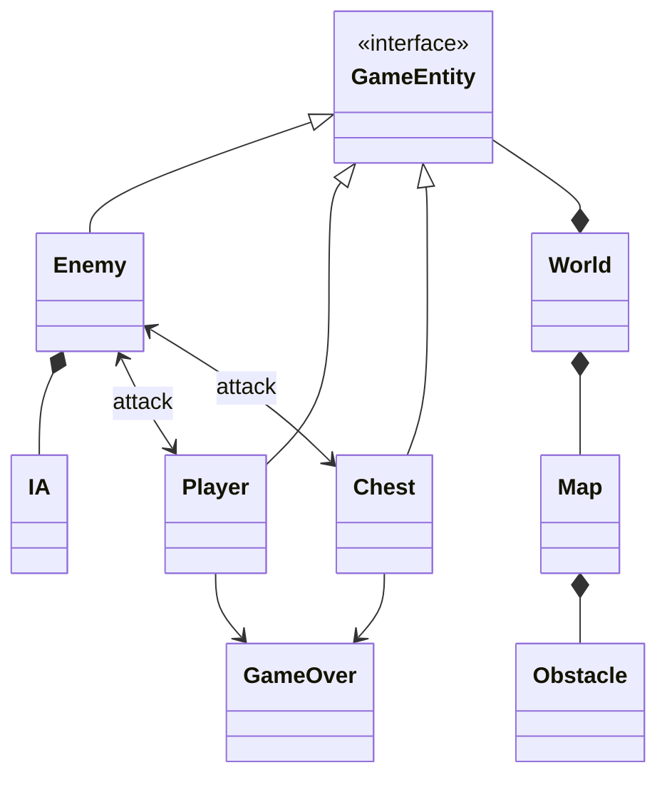
```mermaid
classDiagram
    class GameEntity {
        <<interface>>
    }
    GameEntity <|-- Enemy
    GameEntity <|-- Player
    GameEntity <|-- Chest
    GameEntity --* World
    World *-- Map
    Map *-- Obstacle
    Enemy *-- IA
    Enemy <--> Player : attack
    Enemy <--> Chest : attack
    Player --> GameOver
    Chest --> GameOver
```
# Capitolo 2 - Design
## 2.1 Architettura
L'architettura del nostro programma è quella del tipico Model View Controller. L'applicazione si compone di un controller composto da una singola view che svolge il ruolo di visualizzare gli elementi passati dal controller e di ricevere input dalle periferiche e passarle al controller. Il controller gestisce il main loop del gioco e il passaggio degli input dalla view al model, e dei dati da stampare (sotto forma di GraphicsComponent) dal Model alla View.
Per questo motivo View e Model sono indipendenti tra di loro e si affidano unicamente al controller. Facendo riferimento alle interfacce richieste è possibile cambiare tecnologia della View facilmente in quanto è necessario solo definire la finestra, i metodi per stampare le forme richieste dal gioco (in ViewAPI) e notificare il controller degli input.
Il controller richiama l'update del model, gli passa gli input, prende da lui i componenti grafici che devono essere stampati e ne legge lo stato del gioco. 
Per questo motivo è anche facile cambiare il model dell'applicazione e riusare il resto dell'applicazione per altri giochi.
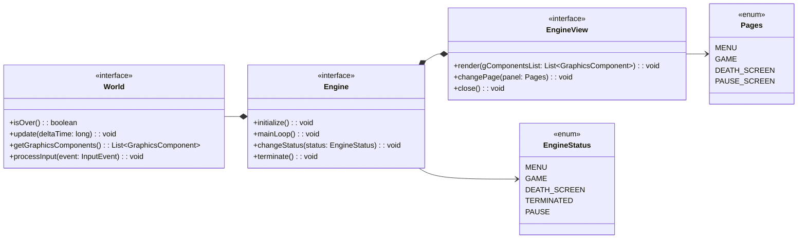
```mermaid
classDiagram
    direction LR
    class World {
        <<interface>>
        +isOver(): boolean
        +update(deltaTime: long): void
        +getGraphicsComponents(): List~GraphicsComponent~
        +processInput(event: InputEvent): void
    }
    class Engine {
        <<interface>>
        +initialize(): void
        +mainLoop(): void
        +changeStatus(status: EngineStatus): void
        +terminate(): void
    }
    class EngineView {
        <<interface>>
        +render(gComponentsList: List~GraphicsComponent~): void
        +changePage(panel: Pages): void
        +close(): void
    }
    Engine *--* EngineView
    World --* Engine

    class EngineStatus {
        <<enum>>
        MENU
        GAME
        DEATH_SCREEN
        TERMINATED
        PAUSE
    }
    Engine --> EngineStatus
    class Pages {
        <<enum>>
        MENU
        GAME
        DEATH_SCREEN
        PAUSE_SCREEN
    }
    EngineView --> Pages
```
## 2.2 Design dettagliato
### Baldazzi Andrea
#### Creazione e salvataggio di entità di gioco

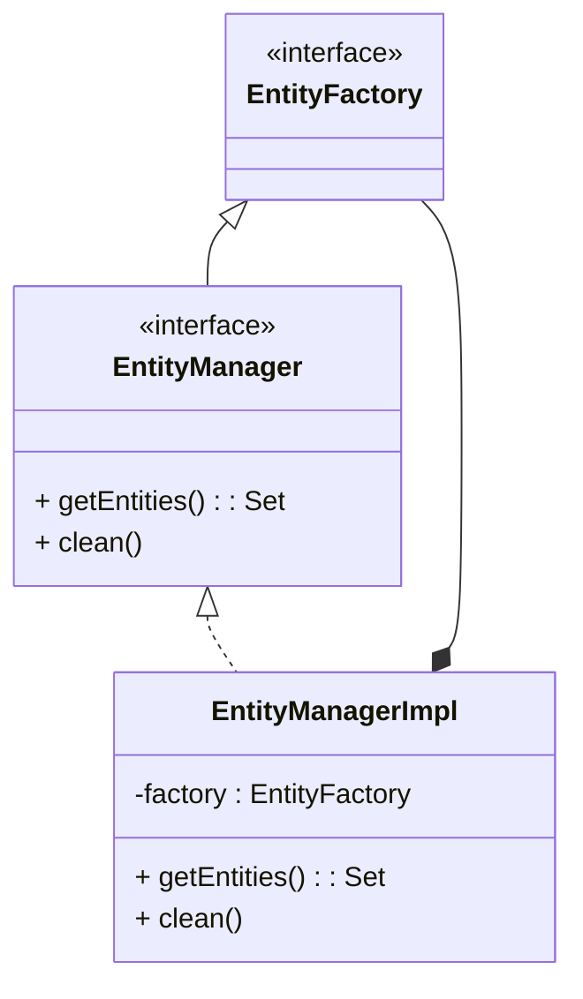
```mermaid
classDiagram
    class EntityFactory {
        <<interface>>
    }
    class EntityManager {
        <<interface>>
        + getEntities() : Set<CachedGameEntity>
        + clean()
    }
    EntityFactory <|-- EntityManager

        class EntityManagerImpl {
        -factory : EntityFactory
        + getEntities() : Set<CachedGameEntity>
        + clean()
    }
    EntityManager <|.. EntityManagerImpl
    EntityFactory --* EntityManagerImpl

```

**Problema:** creare facilmente entità senza fare troppe ripetizioni di codice.
In particolare bisogna fare in modo che chiunque voglia creare un'entità di gioco non deve occuparsi di 
aggiungerla da qualche parte. 

**Soluzione:** dato che era già stata predisposta la creazione di una factory di entità (realizzata da Luca Marchi) si è ritenuto
opportuno creare una struttura che tenesse in memoria le entità generate e si occupasse di distruggerle qual'ora ce ne 
fosse stato il bisogno, ovvero l'EntityManager. Allo scopo è stato utile ricorrere al pattern Decorator, che permette 
al manager di essere riconosciuto come una factory di entità, ma con funzioni aggiuntive per ottenere tutte le entità in gioco
e per fare "pulizia" di quelle che vanno eliminate. 

---
#### Gestione efficiente dello spawning

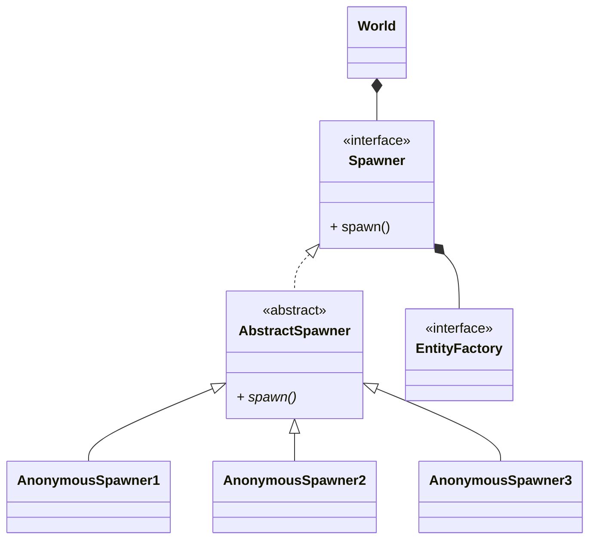
```mermaid
classDiagram
    class Spawner {
        <<interface>>
        + spawn()
    }

    class AbstractSpawner {
        <<abstract>>
        + spawn()*
    }

    class EntityFactory{
      <<interface>>
    }

    World *-- Spawner
    Spawner <|.. AbstractSpawner
    Spawner *-- EntityFactory
    AbstractSpawner <|-- AnonymousSpawner1
    AbstractSpawner <|-- AnonymousSpawner2
    AbstractSpawner <|-- AnonymousSpawner3

```

**Problema:** creare un meccanismo di spawning efficiente e modulare, di modo che sia facile far cominciare un nuovo livello.

**Soluzione:** al fine di risolvere il problema, si è ritenuto utile creare un oggetto apposito che si occupasse
solamente di generare nuovi nemici. Lo Spawner, infatti, al richiamo di `spawn()` genera un nuovo nemico secondo dei criteri stabiliti
a priori. Di fatto, dunque, quando comincia un nuovo livello il resposabile della gestione di gioco attiva l'azione su tutti gli spawner.
Questo comportamento si avvicina molto al pattern Command, in cui l'azione `execute()` viene rinominata `spawn()` per chiarezza d'uso.
Allo stesso tempo, si differenzia dal pattern per la presenza di funzionalità aggiuntive per la gestione della difficoltà e del tipo dello spawner.

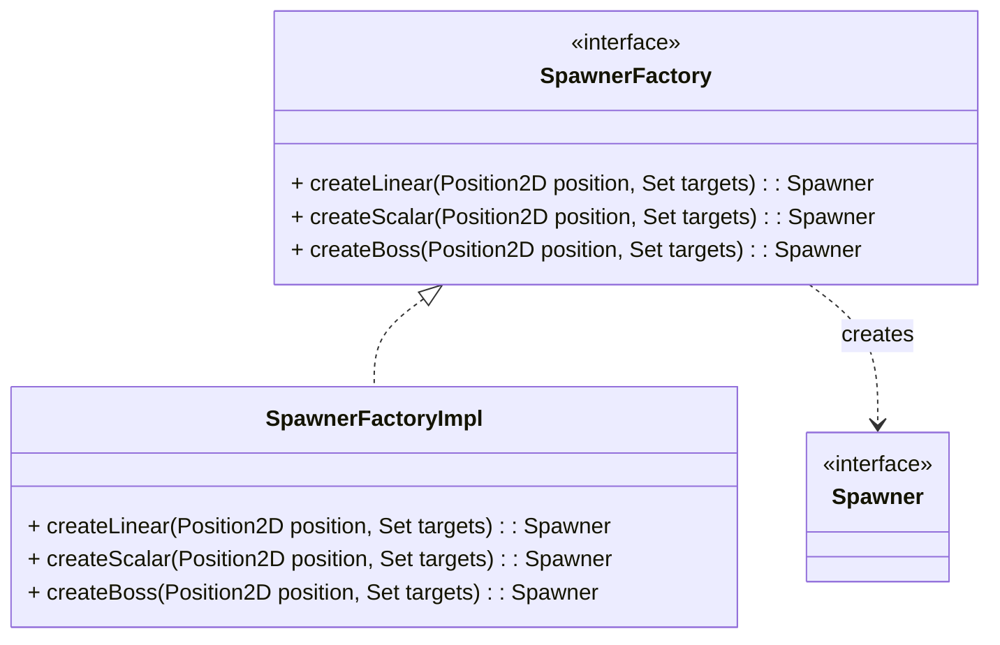
```mermaid
classDiagram
    class SpawnerFactory {
        <<interface>>
        + createLinear(Position2D position, Set<ActiveEntity> targets) : Spawner
        + createScalar(Position2D position, Set<ActiveEntity> targets) : Spawner
        + createBoss(Position2D position, Set<ActiveEntity> targets) : Spawner
    }

    class SpawnerFactoryImpl {
        + createLinear(Position2D position, Set<ActiveEntity> targets) : Spawner
        + createScalar(Position2D position, Set<ActiveEntity> targets) : Spawner
        + createBoss(Position2D position, Set<ActiveEntity> targets) : Spawner
    }

    class Spawner{
      <<interface>>
    }

    SpawnerFactory <|.. SpawnerFactoryImpl
    SpawnerFactory ..> Spawner : creates

```

Oltretutto c'è anche la necessità di avere spawner che generano entità con proprietà diverse, come statistiche che incrementano col tempo oppure boss. A tal proposito si è utilizzato il pattern Factory methods, in cui 
un oggetto si occupa della creazione di Spawner definendo i criteri per l'azione `spawn()`

---
#### Organizzazione della mappa

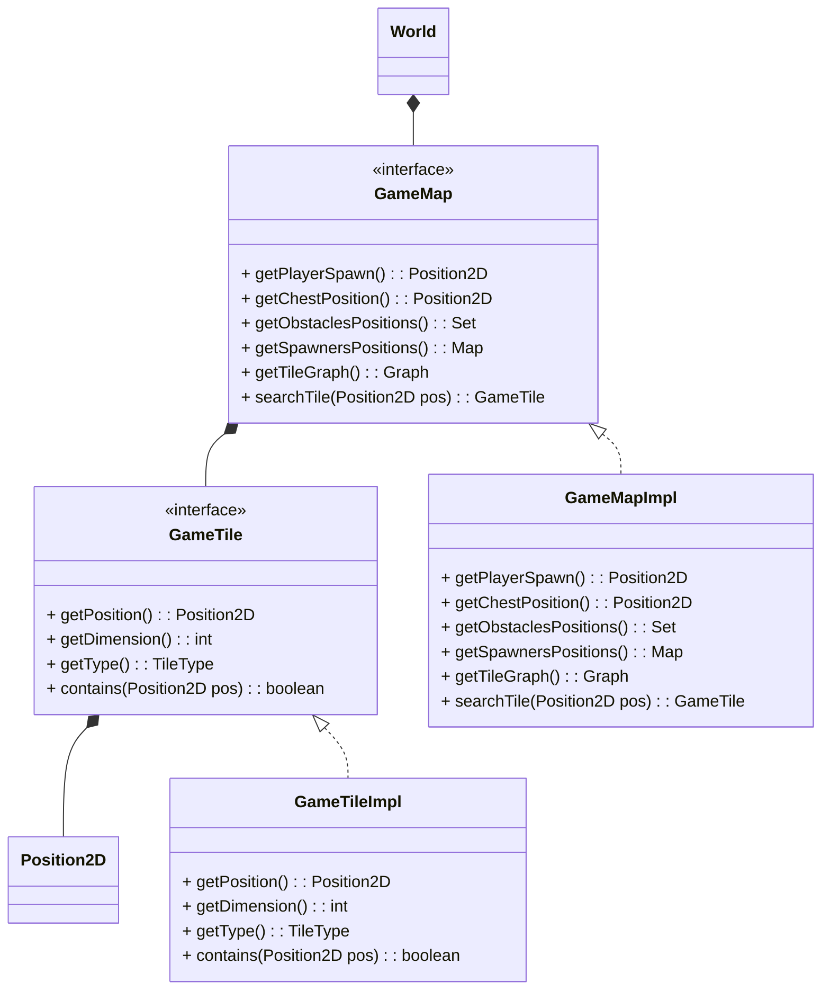
```mermaid
classDiagram
    class GameTile{
        <<interface>>
        + getPosition() : Position2D
        + getDimension() : int
        + getType() : TileType
        + contains(Position2D pos) : boolean
    }

    class GameMap {
        <<interface>>
        + getPlayerSpawn() : Position2D
        + getChestPosition() : Position2D
        + getObstaclesPositions() : Set<Position2D>
        + getSpawnersPositions() : Map<Position2D, SpawnerType>
        + getTileGraph() : Graph
        + searchTile(Position2D pos) : GameTile
    }

    class GameTileImpl{
        + getPosition() : Position2D
        + getDimension() : int
        + getType() : TileType
        + contains(Position2D pos) : boolean
    }

    class GameMapImpl {
        + getPlayerSpawn() : Position2D
        + getChestPosition() : Position2D
        + getObstaclesPositions() : Set<Position2D>
        + getSpawnersPositions() : Map<Position2D, SpawnerType>
        + getTileGraph() : Graph
        + searchTile(Position2D pos) : GameTile
    }

    GameTile *-- Position2D
    World *-- GameMap
    GameMap *-- GameTile
    GameMap <|.. GameMapImpl
    GameTile <|.. GameTileImpl
    
```

**Problema:** suddividere la mappa per poter permettere ai nemici di seguire un percorso verso il loro obbiettivo.

**Soluzione:** l'idea è stata quella di suddividere la mappa di gioco in delle celle chiamate GameTile, di cui ne è composta. Ogni cella ha delle proprietà, come una posizione, una dimensione e un tipo e riesce a determinare se una
data entità di gioco è contenuta al suo interno. La mappa invece è passiva, cioè contiene i criteri per il posizionamento degli oggetti nel gioco, ad esempio la posizione della cassa, dei muri o degli spawner.
Inoltre, alla sua creazione si occupa di creare un grafo delle GameTile libere, che verrà sfruttato dalla AI dei nemici
per permettere loro di inseguire un certo target.

### Bittasi Francesco
#### GraphicsComponent
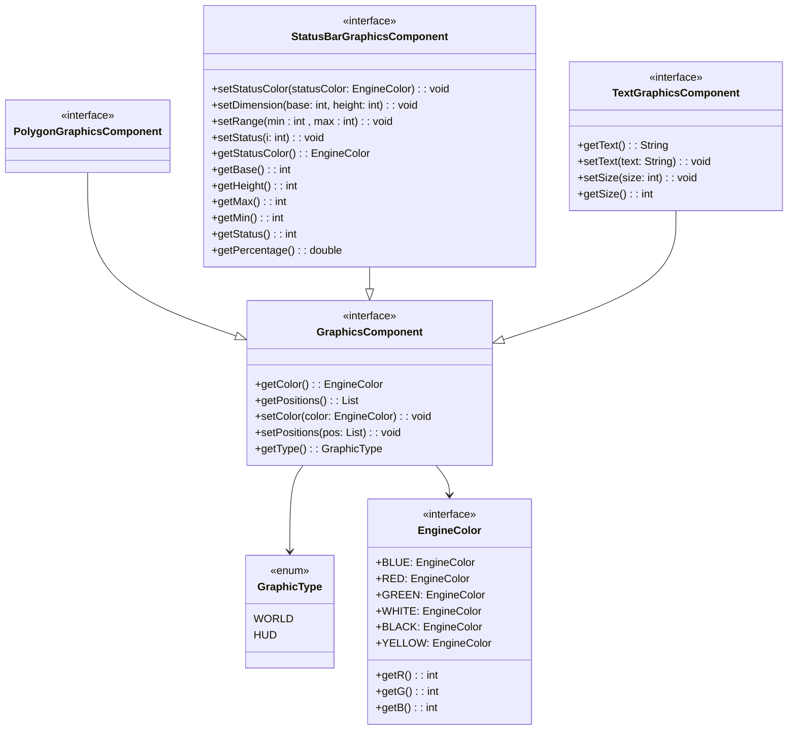
```mermaid
classDiagram
    class GraphicsComponent {
        <<interface>>
        +getColor(): EngineColor
        +getPositions(): List<Position2D>
        +setColor(color: EngineColor): void
        +setPositions(pos: List<Position2D>): void
        +getType(): GraphicType
    }
    class GraphicType {
        <<enum>>
        WORLD
        HUD
    }
    class EngineColor {
        <<interface>>
        +BLUE: EngineColor
        +RED: EngineColor
        +GREEN: EngineColor
        +WHITE: EngineColor
        +BLACK: EngineColor
        +YELLOW: EngineColor
        +getR(): int
        +getG(): int
        +getB(): int
    }
    GraphicsComponent --> GraphicType
    GraphicsComponent --> EngineColor

    class PolygonGraphicsComponent {
        <<interface>>
    }
    PolygonGraphicsComponent --|> GraphicsComponent

    class StatusBarGraphicsComponent {
        <<interface>>
        +setStatusColor(statusColor: EngineColor): void
        +setDimension(base: int, height: int): void
        +setRange(min : int , max : int) : void
        +setStatus(i: int): void
        +getStatusColor(): EngineColor
        +getBase(): int
        +getHeight(): int
        +getMax(): int
        +getMin(): int
        +getStatus(): int
        +getPercentage(): double
    }
    StatusBarGraphicsComponent --|> GraphicsComponent

    class TextGraphicsComponent {
        <<interface>>
        +getText(): String
        +setText(text: String): void
        +setSize(size: int): void
        +getSize(): int
    }
    TextGraphicsComponent --|> GraphicsComponent
```
**Problema:** Creare oggetti che rappresentino l'aspetto grafico di elementi del modello del gioco, in maniera indipendente dalla tecnologia della View.

**Soluzione:** L'interfaccia GraphicsComponent rappresenta un componente grafico generico, questa può essere specializzao in più tipi: Testo, Poligono, Barra di stato, etc.
- Il model dell'applicazione si occupa di creare e aggiornare questi oggetti per dire che aspetto devono assumere gli elementi del gioco.
- Avendo definito tutte queste proprietà, tra cui i colori e che tipo di elemento grafico sono (se parte del mondo di gioco o della HUD), questi componenti grafici sono totalmente indipendenti dalla tecnologia di View adottata.

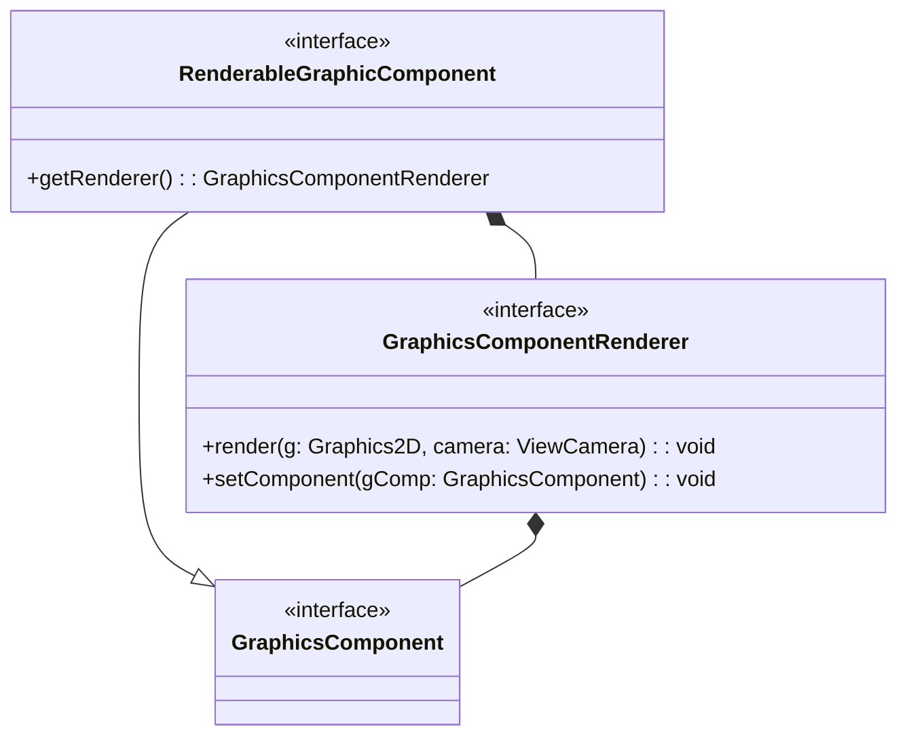
```mermaid
classDiagram
    class RenderableGraphicComponent {
        <<interface>>
        +getRenderer(): GraphicsComponentRenderer
    }
    RenderableGraphicComponent --|> GraphicsComponent
    
    class GraphicsComponentRenderer {
        <<interface>>
        +render(g: Graphics2D, camera: ViewCamera): void
        +setComponent(gComp: GraphicsComponent): void
    }
    RenderableGraphicComponent *-- GraphicsComponentRenderer
    GraphicsComponentRenderer *-- GraphicsComponent
    class GraphicsComponent {
        <<interface>>
    }
```
**Problema:** Permettere alla view di leggere questi componenti grafici e rappresentarli a schermo.

**Soluzione:** Per facilitare la view nell'interpretare questi oggetti è stata definita un'interfaccia che estende GraphicsComponent e che permette di contenere un oggetto che si occupa di renderizzare questi componenti grafici, specifico per la tecnologia usata.
- Il GraphicsComponentRenderer è dunque unico per la tecnologia di View usata: è legato ad un solo componente grafico e alla chiamata del metodo `render` lo stampa a schermo avendo il riferimento alla Camera e agli oggetti necessari per effettuare la stampa a video.
- Per l'implementazione della view alla fine i componenti grafici che le vengono passati si comportano similmente al pattern Command: ottenuto il set di Componenti grafici filtra quelli che è capace di interpretare (chi implementa RenderableGraphicComponent) e li stampa a schermo chiamando il metodo `render`.

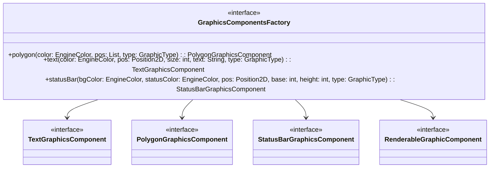
```mermaid
classDiagram
    class GraphicsComponentsFactory {
        <<interface>>
        +polygon(color: EngineColor, pos: List<Position2D>, type: GraphicType): PolygonGraphicsComponent
        +text(color: EngineColor, pos: Position2D, size: int, text: String, type: GraphicType): TextGraphicsComponent
        +statusBar(bgColor: EngineColor, statusColor: EngineColor, pos: Position2D, base: int, height: int, type: GraphicType): StatusBarGraphicsComponent
    }
    GraphicsComponentsFactory --> TextGraphicsComponent
    GraphicsComponentsFactory --> PolygonGraphicsComponent
    GraphicsComponentsFactory --> StatusBarGraphicsComponent
    GraphicsComponentsFactory --> RenderableGraphicComponent
    
    class RenderableGraphicComponent {
        <<interface>>
    }
    
    class PolygonGraphicsComponent {
        <<interface>>
    }

    class StatusBarGraphicsComponent {
        <<interface>>
    }

    class TextGraphicsComponent {
        <<interface>>
    }
```

**Problema:** creare facilmente i componenti grafici.

**Soluzione:** Per permettere al Model dell'applicazione di creare i componenti grafici senza dover sapere dell'associazione di questi coi GraphicsComponentRenderer è stata creata una factory che restituisse il tipo di componente grafico richiesto con già incorporato il renderer della view necessario per permetterne la stampa.

#### Camera
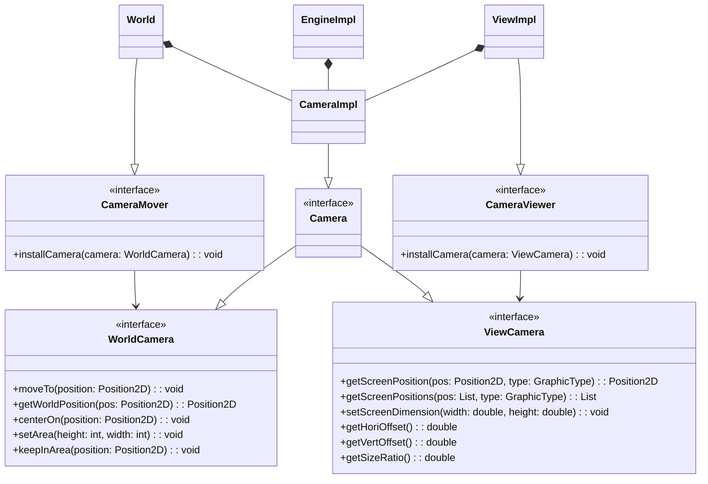
```mermaid
classDiagram
    class ViewCamera {
        <<interface>>
        +getScreenPosition(pos: Position2D, type: GraphicType): Position2D
        +getScreenPositions(pos: List<Position2D>, type: GraphicType): List<Position2D>
        +setScreenDimension(width: double, height: double): void
        +getHoriOffset(): double
        +getVertOffset(): double
        +getSizeRatio(): double
    }

    class WorldCamera {
        <<interface>>
        +moveTo(position: Position2D): void
        +getWorldPosition(pos: Position2D): Position2D
        +centerOn(position: Position2D): void
        +setArea(height: int, width: int): void
        +keepInArea(position: Position2D): void
    }

    class CameraMover {
        <<interface>>
        +installCamera(camera: WorldCamera): void
    }
    CameraMover --> WorldCamera

    class CameraViewer {
        <<interface>>
        +installCamera(camera: ViewCamera): void
    }
    CameraViewer --> ViewCamera

    class Camera {
        <<interface>>
    }
    Camera --|> WorldCamera
    Camera --|> ViewCamera 

    CameraImpl --|> Camera
    EngineImpl *-- CameraImpl

    World --|> CameraMover
    World *-- CameraImpl
    ViewImpl *-- CameraImpl
    ViewImpl --|> CameraViewer
```
**Problema:** Sullo schermo va visualizzata solo una parte del mondo di gioco, deve mantere le proporzioni corrette per qualunque formato di schermo e la porzione visibile deve essere scelta dal Model dell'applicazione.

**Soluzione:** L'engine si occupa di creare un oggetto (nel progetto la classe "CameraImpl") che si occupa di effettuare i calcoli di conversione da coordinate del mondo a coordinate sullo schermo e viceversa. L'engine darà il riferimento a questo oggetto al World e all'EngineView che lo interfacceranno tramite delle interfacce specifiche per quello che ci possono fare:
- Il world ha accesso ai metodi che gli permettono di spostare la telecamera e di ottenere le coordinate del mondo a partire da quelle sullo schermo (nel caso di quando si riceve input dal puntatore).
- L'EngineView ha accesso ai metodi di conversione delle coordinate da world a schermo, metodi per informare la telecamera delle dimensioni della finestra e per ottenere informazioni sulle proporzioni della schermata di gioco (per poter generare bande nere a bordo schermo se necessario).
    - al momento della stampa l'EngineView passa il riferimento della ViewCamera ai GraphicsComponentRenderer che si occupano della effettiva stampa a schermo.

Non è stato adottato alcun design pattern particolare se non lo Strategy: le diverse interfacce definiscono infatti una classe Camera generica che può avere l'implementazione che vogliamo, quella adottata nel nostro gioco è una implementazione standard, ma potremmo adottarne una che segue una logica diversa andando a distorcere le cose visualizzate a schermo senza dover modificare in alcun modo le classi che usano la telecamera.

#### Input
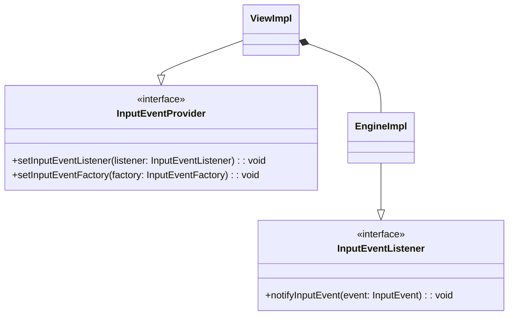
```mermaid
classDiagram
    class InputEventListener {
        <<interface>>
        +notifyInputEvent(event: InputEvent): void
    }
    class InputEventProvider {
        <<interface>>
        +setInputEventListener(listener: InputEventListener): void
        +setInputEventFactory(factory: InputEventFactory): void
    }
    ViewImpl *-- EngineImpl

    EngineImpl --|> InputEventListener
    ViewImpl --|> InputEventProvider
```
**Problema:** Notificare il controller delle azioni dell'utente sulle periferiche.

**Soluzione:** Usando il pattern Observer abbiamo reso l'implementazione del controller un osservatore di "InputEvent". La view è il provider, il creatore di questi InputEvent e si occupa di notificare il controller quando uno di questi avviene.

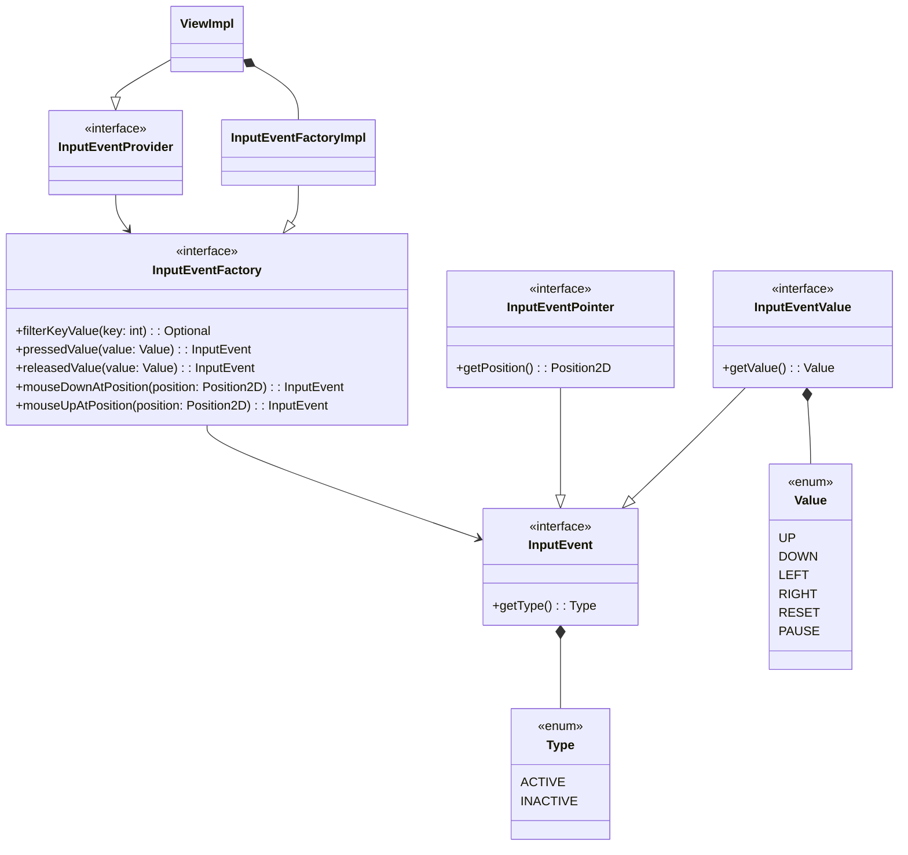
```mermaid
classDiagram
    ViewImpl *-- InputEventFactoryImpl
    ViewImpl --|> InputEventProvider
    class InputEventProvider {
        <<interface>>
    }
    InputEventProvider --> InputEventFactory
    InputEventFactoryImpl --|> InputEventFactory
    class InputEventFactory {
        <<interface>>
        +filterKeyValue(key: int): Optional<Value>
        +pressedValue(value: Value): InputEvent
        +releasedValue(value: Value): InputEvent
        +mouseDownAtPosition(position: Position2D): InputEvent
        +mouseUpAtPosition(position: Position2D): InputEvent
    }
    InputEventFactory --> InputEvent

    class InputEvent {
        <<interface>>
        +getType(): Type
    }
    class Type {
        <<enum>>
        ACTIVE
        INACTIVE
    }
    InputEvent *-- Type

    class InputEventPointer {
        <<interface>>
        +getPosition(): Position2D
    }
    InputEventPointer --|> InputEvent

    class InputEventValue {
        <<interface>>
        +getValue(): Value
    }
    class Value {
        <<enum>>
        UP
        DOWN
        LEFT
        RIGHT
        RESET
        PAUSE
    }
    InputEventValue *-- Value
    InputEventValue --|> InputEvent
```
**Problema:** Creare una classe di oggetti che rappresenti gli eventi di input indipendentemente dalla tecnologia di View adottata.

**Soluzione:** L'interfaccia InputEvent rappresenta un evento di Input che può essere ricevuto da un InputEventListener. Questa interfaccia viene poi estesa in tipologie secondarie che vanno a specificare un tipo particolare di input come quelle di un puntatore o di un determinato valore.
- Per permettere al provider di generare questi oggetti facilmente abbiamo creato una Factory di eventi che gli viene fornita.
- E' grazie al metodo `filterKeyValue` della factory che i tasti della tastiera vengono convertiti in valori che rappresentano un'azione di gioco.
- Sarà compito del listener filtrare i vari input che riceve per vedere cosa gli interessa e agire di conseguenza.

#### Weapon
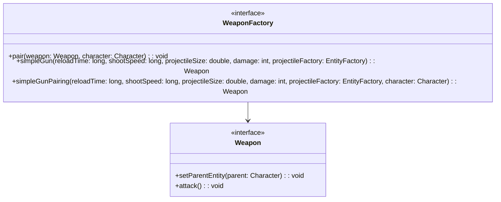
```mermaid
classDiagram
    class Weapon {
        <<interface>>
        +setParentEntity(parent: Character): void
        +attack(): void
    }

    class WeaponFactory {
        <<interface>>
        +pair(weapon: Weapon, character: Character): void
        +simpleGun(reloadTime: long, shootSpeed: long, projectileSize: double, damage: int, projectileFactory: EntityFactory): Weapon
        +simpleGunPairing(reloadTime: long, shootSpeed: long, projectileSize: double, damage: int, projectileFactory: EntityFactory, character: Character): Weapon
    }
    WeaponFactory --> Weapon
```

**Problema:** Creare un'arma che possa essere facilmente associata ad un unico personaggio.

**Soluzione:** Una Factory di Weapon fornisce metodi per creare facilmente il tipo di arma desiderato e per associarla ad un personaggio. La armi implementano l'interfaccia Weapon che identifica un tipo di arma generico (pattern Strategy), questo permette di creare armi con comportamenti diversi senza dover modificare il codice che le utilizza (questo non è stato fatto nel progetto solo per questione di tempo): basta creare nuove implementazioni di Weapon e aggiungere i metodi nella factory.

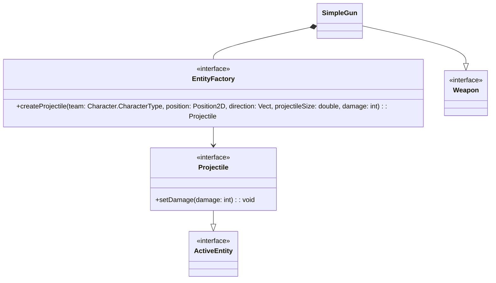
```mermaid
classDiagram
    class EntityFactory {
        <<interface>>
        +createProjectile(team: Character.CharacterType, position: Position2D, direction: Vect, projectileSize: double, damage: int): Projectile
    }
    EntityFactory --> Projectile
    
    SimpleGun *-- EntityFactory
    SimpleGun --|> Weapon

    class Projectile {
        <<interface>>
        +setDamage(damage: int): void
    }
    class ActiveEntity {
        <<interface>>
    }
    Projectile --|> ActiveEntity
    class Weapon {
        <<interface>>
    }
```

**Problema:** Creare un'arma che possa sparare dei proiettili.

**Soluzione:** SimpleGun implementa l'interfaccia Weapon e fa riferimento ad una EntityFactory per generare nuovi proiettili; questi infatti sono delle ActiveEntiy, entità che si possono muovere e collidere con altre. SimpleGun alla creazione accetta parametri per impostare la velocità di sparo, la dimensione dei proiettili, la loro velocità e danno. Dunque solo da SimpleGun si potrebbero creare diversi tipi di armi.

### Marchi Luca
#### **Realizzazione di entità dotate di "vita"**
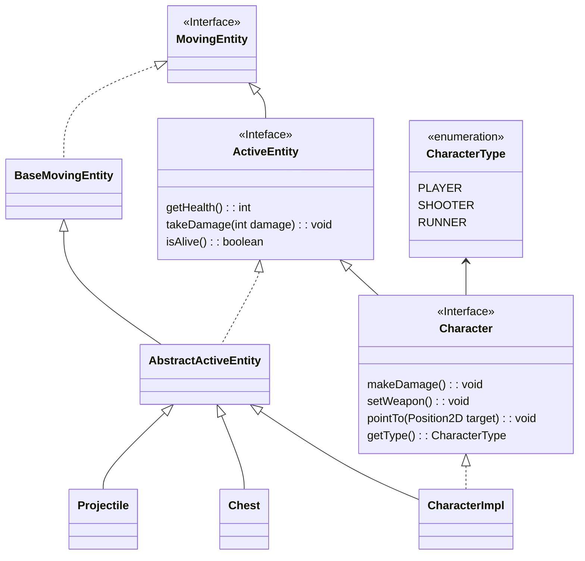
```mermaid
classDiagram
  MovingEntity <|-- ActiveEntity
  BaseMovingEntity <|-- AbstractActiveEntity
  MovingEntity <|.. BaseMovingEntity
  ActiveEntity <|.. AbstractActiveEntity
  ActiveEntity <|-- Character
  AbstractActiveEntity <|-- CharacterImpl
  Character <|.. CharacterImpl
  CharacterType <-- Character
  AbstractActiveEntity <|-- Chest
  AbstractActiveEntity <|-- Projectile

  <<Interface>> MovingEntity
  <<Inteface>> ActiveEntity
  <<Interface>> Character
  <<enumeration>> CharacterType

  class ActiveEntity{
    getHealth() : int
    takeDamage(int damage) : void
    isAlive() : boolean 
  }

  class Character{
    makeDamage() : void
    setWeapon() : void
    pointTo(Position2D target) : void
    getType() : CharacterType
  }

  class CharacterType{
    <<Enumeration>>
    PLAYER 
    SHOOTER
    RUNNER
  }

  class AbstractActiveEntity{
  }

  class CharacterImpl{
  }

```
**Problema:** Progettazione delle diverse entità di gioco (in particolare quelle dotate di vita). Il design deve essere tale da dividere in maniera chiara le entità e i loro ruoli, inoltre deve garantire una facile estendibilità per modifiche future evitando la ripetizione di codice.

**Soluzione:** Per risolvere il problema di design delle entità è stato utilizzato il pattern Composite, dove la struttura ad albero (tipica di questo pattern) ha come radice `CachedGameEntity`, da cui tutte le altre entità ereditano le caratteristiche comuni. 
Nella gerarchia del Composite l' `ActiveEntity`, ovvero entità in grado di muoversi e dotata di vita, eredita il movimento estendendo `MovingEntity` e implementa il componente vita. Le entità di tipo `Character`, invece, rappresentano il player ed i nemici, quindi sono dotate di un'arma per poter infliggere danni. Questo tipo di design consente di estendere facilmente le funzionalità del gioco, rendendo possibile l'aggiunta di nuove entità o di nuovi comportamenti evitando di duplicare porzioni di codice. Ad esempio se si volesse creare un nuovo oggetto dotato di vita, basterebbe estendere la classe astratta `AbstractActiveEntity` (la quale definisce un'implementazione di base dei metodi relativi alle entità con la vita), e quest'ultimo risulterebbe una foglia dell'albero del Composite.
Il difetto di questo design è che non si possono creare entità con la vita senza il movimento. Per risolvere questo problema si sarebbe potuto realizzare una classe intermedia la quale avrebbe fornito esclusivamente la vita. In questo modo però, `ActiveEntity` avrebbe dovuto estendere sia quest'ultima classe, sia `MovingEntity`. Rendendo il movimento un campo `Optional` si è risolto il problema, permettendo di creare entità dotate di vita, ma che non si possono muovere come `Chest` (foglia del composite).
Inoltre viene utilizzato il pattern Strategy tramite l'utilizzo di interfacce. Questo permette di aggiungere diverse implementazioni, diverse "strategie" e di poter scegliere la più opportuna a runtime.

#### **Creazione entità**
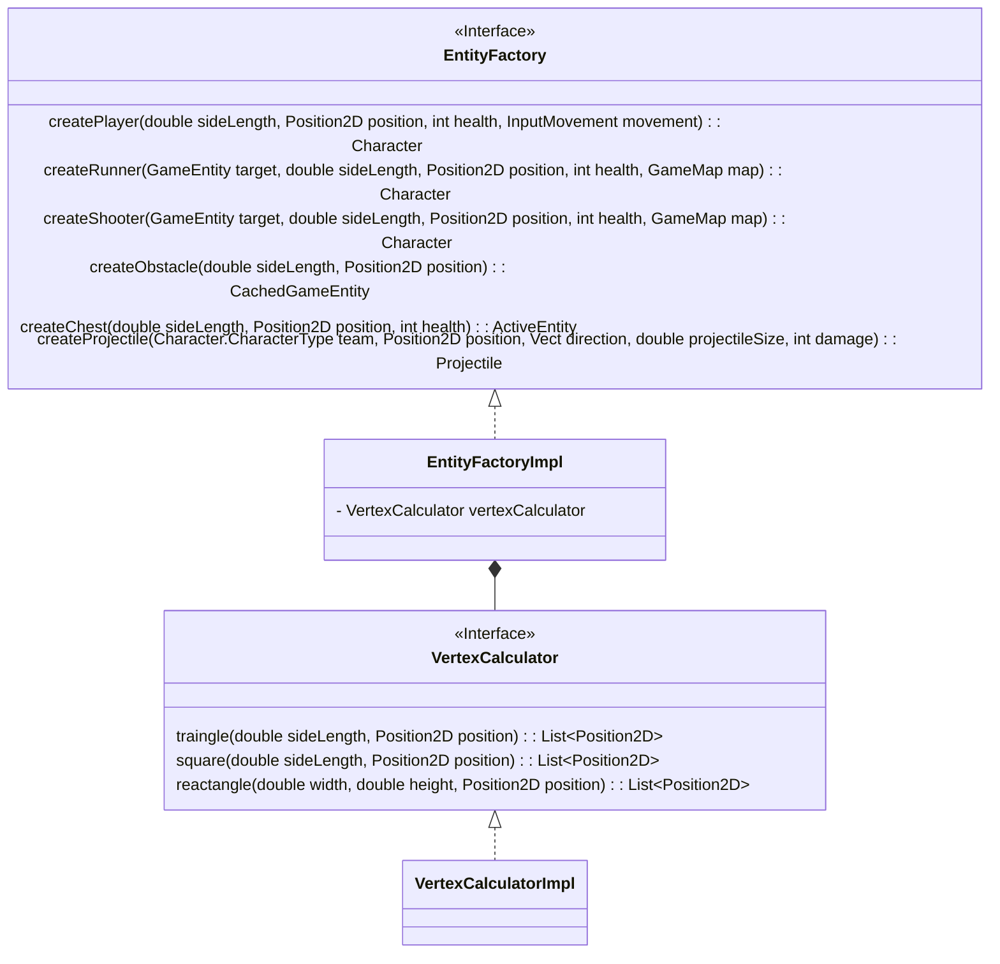
```mermaid
classDiagram
  EntityFactory <|.. EntityFactoryImpl
  EntityFactoryImpl  *-- VertexCalculator
  VertexCalculator <|.. VertexCalculatorImpl

  <<Interface>> EntityFactory
  <<Interface>> VertexCalculator

  class EntityFactory{
    createPlayer(double sideLength, Position2D position, int health, InputMovement movement) : Character

    createRunner(GameEntity target, double sideLength, Position2D position, int health, GameMap map) : Character

    createShooter(GameEntity target, double sideLength, Position2D position, int health, GameMap map) : Character

    createObstacle(double sideLength, Position2D position) : CachedGameEntity

    createChest(double sideLength, Position2D position, int health) : ActiveEntity

    createProjectile(Character.CharacterType team, Position2D position, Vect direction, double projectileSize, int damage) : Projectile

  }

  class EntityFactoryImpl{
    - VertexCalculator vertexCalculator
  }

  class VertexCalculator{
    traingle(double sideLength, Position2D position) : List~Position2D~

    square(double sideLength, Position2D position) : List~Position2D~

    reactangle(double width, double height, Position2D position) : List~Position2D~
  }

```

**Problema:** Nel videogame sono presenti molteplici entità di gioco, tra cui player, nemici, ostacoli, proiettili, ecc. Ogni tipo di entità ha comportamenti e attributi diversi. Questi oggetti devono poter essere istanziati comodamente nel World e nelle altre classi che li utilizzano, così da disporli nella mappa. Se si utilizzasse direttamente l'operatore 'new' nella creazione di oggetti ciò potrebbe portare ad una dipendenza diretta tra il codice che lo istanzia e la classe dell'oggetto stesso.

**Soluzione:** Utilizzando il design pattern Factory Method viene risolto il problema:
* Questo pattern separa il codice che crea gli oggetti dalla loro implementazione concreta, garantendo una migliore divisione delle responsabilità nel codice.
* I metodi della Factory (nel codice rappresentata da EntityFactory) consentono di istanziare vari tipi di entità in maniera flessibile. Così facendo la classe client può richiedere l'oggetto desiderato senza dover conoscere i dettagli implementativi.
* Delegando la logica creazionale alla Factory inoltre vengono ridotte le dipendenza tra la classe client e la classe concreta dell'oggetto.
Si è preferito scegliere questo pattern rispetto ad un Builder perchè in questo caso i dettagli necessari alla creazione dell'oggetto sono noti a priori, ogni metodo della factory crea un tipo specifico di oggetto con parametri ben definiti. Istanziare oggetti step-by-step con numerosi passaggi, come fornisce il pattern Builder, non era adeguato.
La classe EntityFactoryImpl utilizza una classe utilità per calcolare le coordinate dei vertici che sono necessari alla creazione di oggetti. Quest'ultima classe, VertexCalculatorImpl, si occupa esclusivamente del calcolo dei vertici di diverse figure geometriche.

#### IA dei nemici
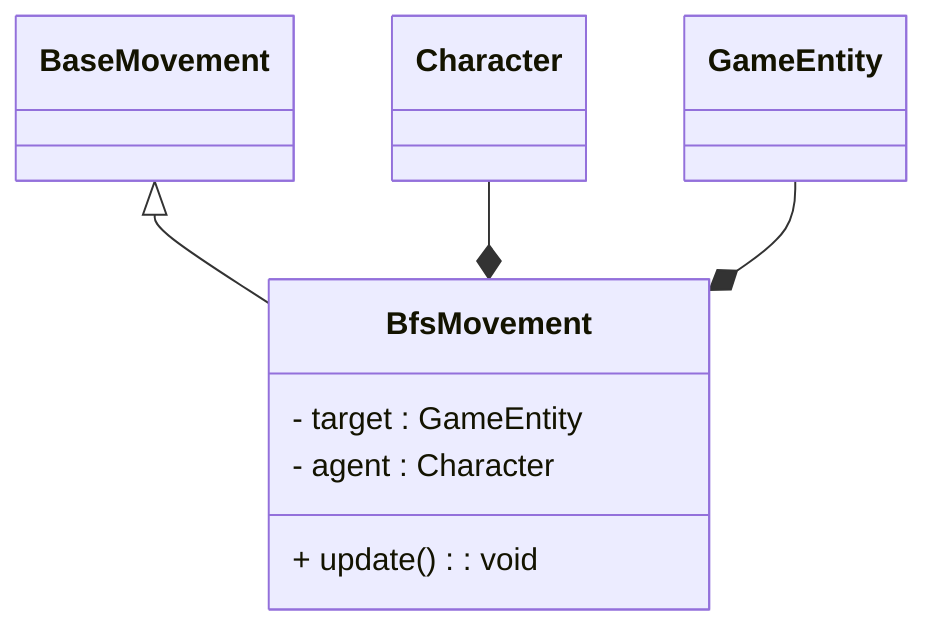
```mermaid
classDiagram
  BaseMovement <|-- BfsMovement
  Character --* BfsMovement
  GameEntity --* BfsMovement

  class BfsMovement{
    - target : GameEntity
    - agent : Character

    + update() : void
  }
```
**Problema:** All'interno del gioco è necessario gestire il movimento dei nemici. Questi ultimi devono muoversi verso il player, oppure verso la chest e fermarsi una volta giunti a destinazione.

**Soluzione:** Per risolvere il problema del movimento dei nemici, viene utilizzato un algoritmo di ricerca Breadth-First Search (BFS), che è efficace ed efficiente nel trovare il percorso più breve tra due punti (nel codice rappresentati dal centro di due GameTile) in un grafo non pesato. 
L'implementazione della BFS è stata presa dalla libreria JGrapht.
L'algoritmo di ricerca viene implementato nella classe `BfsMovement` la quale estende `BaseMovement`. Ogni volta che il metodo update() viene chiamato, se il nemico (agent), che viene preso nel costruttore della classe, non ha ancora raggiunto il suo obiettivo, si sposta verso il nodo successivo in direzione del target (Player o Chest).

### Monaco Andrea
#### Creazione di entità con hitbox e movimento
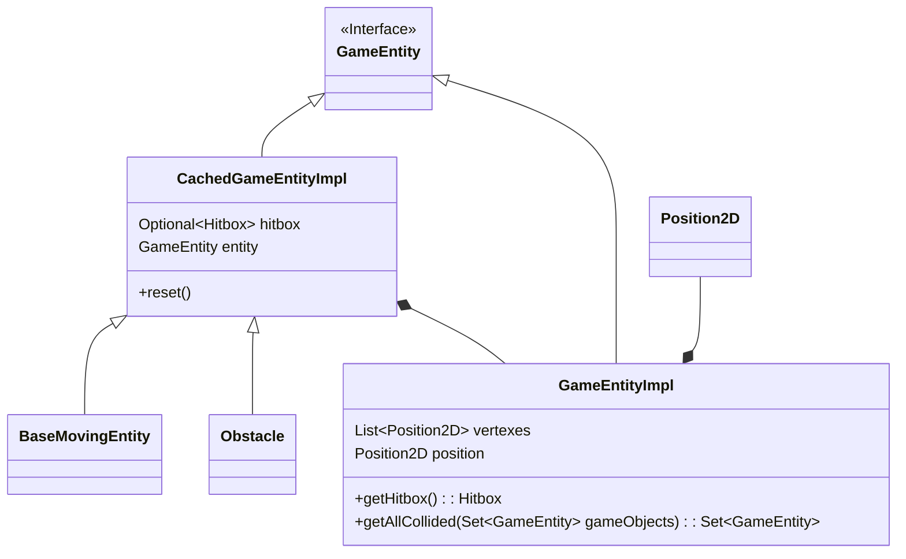
```mermaid
classDiagram
  GameEntity <|-- CachedGameEntityImpl
  CachedGameEntityImpl <|-- BaseMovingEntity
  CachedGameEntityImpl <|-- Obstacle
  CachedGameEntityImpl *-- GameEntityImpl
  GameEntity <|-- GameEntityImpl
  Position2D --* GameEntityImpl

  <<Interface>> GameEntity

  class GameEntityImpl{
    List~Position2D~ vertexes
    Position2D position
    +getHitbox() : Hitbox
    +getAllCollided(Set~GameEntity~ gameObjects) : Set~GameEntity~
  }

  class CachedGameEntityImpl{
    Optional~Hitbox~ hitbox
    GameEntity entity

    +reset()
  }

  
```
**Problema:** Il gioco coinvolge esclusivamente entità con un corpo fisico e ogni entità può avere delle collisioni con le altre. Gestire queste collisioni tra queste entità può diventare complesso a livello computazionale se fatto in modo inefficente, ogni entità condivide poi buona parte del codice con le altre e solitamente differisce solo per pochi metodi.

**Soluzione:** Per risolvere questo problema è implementato il pattern proxy. In questo modo è possibile controllare la hitbox delle varie entità senza doverla ricalcolare ogni volta, quindi è possibile inserire anche un gran numero di entità all'interno di una singola scena senza che venga richiesto uno sforzo computazionale eccessivo.
La motivazione principale che spinge a questa soluzione è l'ottimizzazione delle collisioni: il proxy `CachedGameEntityImpl` memorizza le informazioni sulla hitbox dell'entità. Questo permette di ricalcolare le collisioni e le hitbox solo dopo che le entità effettuino un movimento. Qualora si volesse utilizzare `GameEntity` al posto di `CachedGameEntity` è sufficente rinominare la classe Cached Game entity in game entity dove necessario e rimuovere dalla classe principale world l'utilizzo del metodo reset.

#### Creazione delle Hitbox nel gioco
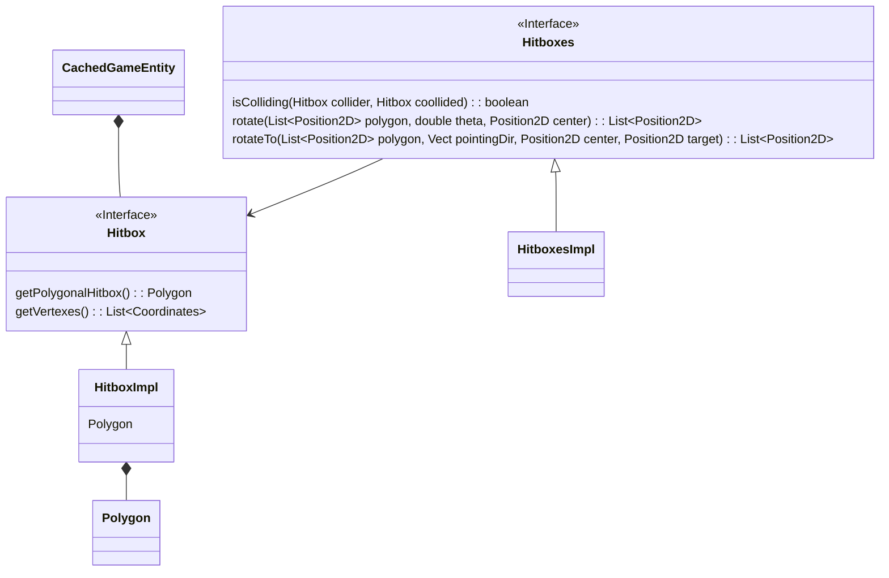
```mermaid
classDiagram
  CachedGameEntity *-- Hitbox

  Hitbox <|-- HitboxImpl
  Hitboxes <|-- HitboxesImpl
  HitboxImpl *-- Polygon
  Hitboxes --> Hitbox

  <<Interface>> Hitbox
  <<Interface>> Hitboxes

  class Hitbox{
    getPolygonalHitbox() : Polygon
    getVertexes() : List~Coordinates~
  }

  class HitboxImpl{
    Polygon
  }

  class Hitboxes{
    isColliding(Hitbox collider, Hitbox coollided) : boolean
    rotate(List~Position2D~ polygon, double theta, Position2D center) : List~Position2D~
    rotateTo(List~Position2D~ polygon, Vect pointingDir, Position2D center, Position2D target) : List~Position2D~
  }
```
**Problema:** Ogni entità deve avere una hitbox con cui possa interfacciarsi con le altre e rilevare le collisioni.

**Soluzione:** Un'implementazione dei poligoni comoda si può ottenere dalla librerria JTS che però è molto complessa. In questo caso si fa uso del pattern Facade per creare una serie di metodi che sfruttando JTS permettono di eseguire operazioni tra poligoni in modo semplificato.

#### Gestione delle collisioni nel gioco
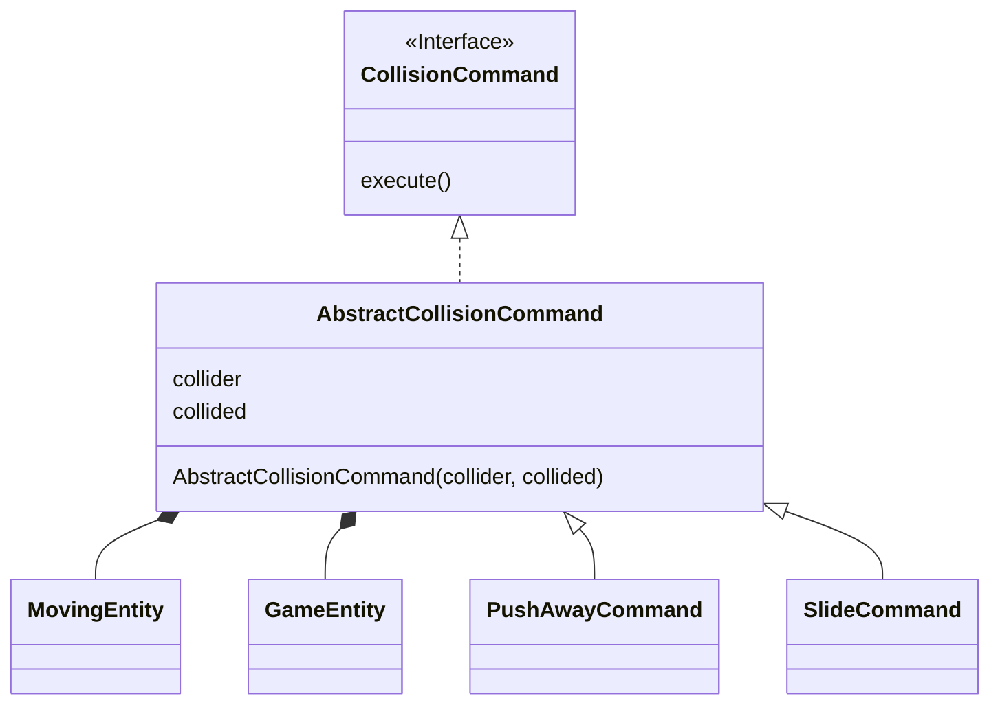
```mermaid
classDiagram
  CollisionCommand <|.. AbstractCollisionCommand
  AbstractCollisionCommand *-- MovingEntity
  AbstractCollisionCommand *-- GameEntity
  AbstractCollisionCommand <|-- PushAwayCommand
  AbstractCollisionCommand <|-- SlideCommand

  <<Interface>> CollisionCommand

  class CollisionCommand{
    execute()
  }

  class AbstractCollisionCommand{
    collider
    collided
    AbstractCollisionCommand(collider, collided)
  }
```
**Problema:** Nel contesto del gioco avvengo numerose collisioni, tuttavia la gestione delle collisioni tra le entità possono variare in base al tipo di collisione. Quindi bisogna progettare un sistema che consenta modifiche specifiche al movimento in base al tipo di collisione.

**Soluzione:** Per risolvere il problema si è scelto di utilizzare il pattern Command. Questo pattern consente di variare le azioni da intraprendere a seguito di una collisione in base alla classe contreta che estende il command.
`CollisionCommand` è l'interfaccia che definisce il metodo execute che sarà implementato dalle classi concrete per eseguire azioni specifiche a seguito di una collisione. In `PushAwayCommand` e in `SlideCommand` la direzione del collider, che è una moving entity, viene modificata in base alla posizione dell'altra entità.

#### Implementazione dei movimenti delle entità
```mermaid
classDiagram
  MovingEntity <|.. BaseMovingEntity
  BaseMovingEntity *-- Movement
  Movement <|.. BaseMovement
  BaseMovement <|-- InputMovement
  BaseMovement <|-- LinearMovement
  BaseMovement <|-- Fixed
  BaseMovement <|-- RandomMovement

  MovementFactory <|.. MovementFactoryImpl
  InputMovement <-- MovementFactory
  LinearMovement <-- MovementFactory
  RandomMovement <-- MovementFactory
  Fixed <-- MovementFactory

  <<Interface>> Movement
  <<Interface>> MovementFactory
  <<Interface>> MovingEntity

  class Movement{
    update()
    getDirection(Vect direction)
    setDirection() : Vect
  }

  class InputMovement{
    Vect inputVector
    +addDirection(Directions dir)
    +removeDirection(Directions dir)
    +setNullDirection()
  }

  class BaseMovement{
    Vect dirVector
  }

  class MovementFactory{
    createLinearMovement(Vect direction) : LinearMovement
    createRandomMovement() : RandomMovement
    createInput() : InputMovement
    createFixed() : Fixed
  }

  class BaseMovingEntity{
    Movement movement
    +updatePos(long deltatime)
    +getDirection() : Vect
    +setDirection(Vect)
    #appyCollison()
  }
```
**Problema:** Diverse entità di gioco possono avere diversi movimenti che potrebbero anche cambire a seconda di diversi fattori. Inoltre è importante separare la logica di moviemento dalla logica delle entità stessa per migliorare la modularità e la manutelibilità del codice.

**Soluzione:** Per affrontare il problema è stata implementata una soluzione che combina il pattern Factory Method e il pattern Strategy.
Factory Method Pattern:
La classe MovemntFactory funge da creatore di oggetti di tipo Movement. Questo pattern consente di creare vari tipi di Movement in modo flessibile e scalabile.
Strategy Pattern:
Le varie classi condividono l'interfaccia Movement ma l'implementazione dei metodi varia a seconda del tipo di movement.
Inoltre il movimento è inserito come campo all'interno delle varie classi che possono richiamare il vettore direzione risultante del movement e chiamare update per far aggionare al movement questo vettore in base alle logiche della classe.

# Capitolo 3 - Sviluppo
## 3.1 Testing automatizzato
* BfsMovementTest: viene testato il funzionamento del movimento dei nemici. Ad ogni chiamata update() il nemico, se non ha ancora raggiunto l'obiettivo, deve spostarsi nella posizione successiva in direzine del target. Per ogni tipologia di nemico viene controllato che si fermi nella corretta posizione, gli Shooter dovranno arrestarsi lontano dal target mentre i Runner devono avvicinarsi il più possibile.

* EntityFactoryTest: Per ognuna delle entità viene testata la sua corretta creazione.
* VertexCalculatorTest: Viene testato il corretto calcolo della posizione dei vertici, per le figure geometriche triangolo equilatero, quadrato e rettangolo.
* GameMapTest: viene testata la corretta creazione della mappa, la quale deve avere
almeno un muro, una cassa, un player e degli spawner.
* EntityManagerTest: viene testato l'EntityManager, quindi il salvataggio delle entità
create, la pulizia di quelle non più vive e la condizione di morte di tutti i nemici.
## 3.2 Note di sviluppo
### Baldazzi Andrea
#### Utilizzo della libreria JGraphT
Utilizzata per costruire il grafo di GameTile: https://github.com/frabitta/OOP23-gfight/blob/1f46024e7a794b0b54e1317836fbd691eb322ea7/src/main/java/gfight/world/map/impl/GameMapImpl.java#L138

#### Utilizzo di Optional
Per costruire il grafo solo quando necessario e velocizzare la creazione della mappa: https://github.com/frabitta/OOP23-gfight/blob/1f46024e7a794b0b54e1317836fbd691eb322ea7/src/main/java/gfight/world/map/impl/GameMapImpl.java#L109

#### Utilizzo di Stream
Usati molto frequentemente, due esempi:
- https://github.com/frabitta/OOP23-gfight/blob/1f46024e7a794b0b54e1317836fbd691eb322ea7/src/main/java/gfight/world/map/impl/GameMapImpl.java#L83
- https://github.com/frabitta/OOP23-gfight/blob/1f46024e7a794b0b54e1317836fbd691eb322ea7/src/main/java/gfight/world/impl/EntityManagerImpl.java#L114

#### Utilizzo di Lambda
Un esempio: https://github.com/frabitta/OOP23-gfight/blob/1f46024e7a794b0b54e1317836fbd691eb322ea7/src/main/java/gfight/view/impl/MenuPanel.java#L95

### Bittasi Francesco
#### Utilizzo di Stream
Adottate frequentemente per la gestione di elenchi di dati:
- https://github.com/frabitta/OOP23-gfight/blob/fb4012549a225ac1774cfe5618e629f0fbe8a238/src/main/java/gfight/engine/input/impl/InputEventFactoryImpl.java#L19
- https://github.com/frabitta/OOP23-gfight/blob/dc63c887effa5add94c655e99de1bdea0b6ec113/src/main/java/gfight/view/impl/Canvas.java#L67

#### Utilizzo di Optional
Usati per convertire i tasti premuti in possibili Value:
- https://github.com/frabitta/OOP23-gfight/blob/fb4012549a225ac1774cfe5618e629f0fbe8a238/src/main/java/gfight/engine/input/impl/InputEventFactoryImpl.java#L18

#### Sincronizzazioni dei thread
Nella classe EngineImpl per gestire conflitti tra main thread e AWT-EventQueue thread:
- Utilizzo di Semaphore per gestire l'accesso alla coda di input:
    - https://github.com/frabitta/OOP23-gfight/blob/c9d24b2e9f147e8c17c4e537ac0ab8cd9a664bd8/src/main/java/gfight/engine/impl/EngineImpl.java#L164
    - https://github.com/frabitta/OOP23-gfight/blob/c9d24b2e9f147e8c17c4e537ac0ab8cd9a664bd8/src/main/java/gfight/engine/impl/EngineImpl.java#L192
- Utilizzo di wait e notify per gestire gli stati dell'engine:
    - https://github.com/frabitta/OOP23-gfight/blob/c9d24b2e9f147e8c17c4e537ac0ab8cd9a664bd8/src/main/java/gfight/engine/impl/EngineImpl.java#L132
    - https://github.com/frabitta/OOP23-gfight/blob/c9d24b2e9f147e8c17c4e537ac0ab8cd9a664bd8/src/main/java/gfight/engine/impl/EngineImpl.java#L213

#### Game as a lab
Ho preso ispirazione dal codice di Game as a lab per la base dell'engine e della view, in particolare per la scrittura della classe `Canvas`.
- https://github.com/pslab-unibo/oop-game-prog-patterns-2022

### Marchi Luca
#### Utilizzo di stream, lambda expressions, method reference e Optional
Queste feaure vengono utilizzate spesso in tutto il codice. Riporto un esempio dove vengono utilizzate tutte quante assieme:
- https://github.com/frabitta/OOP23-gfight/blob/f616e07d4aab0a1bc7f136b06cddd62747df43a6/src/main/java/gfight/world/movement/impl/BfsMovement.java#L96C9-L102C50

#### Uso di librerie di terze parti (JGrapht)
Viene utilizzata l'algoritmo BFS della libreria JGrapht:
- https://github.com/frabitta/OOP23-gfight/blob/f616e07d4aab0a1bc7f136b06cddd62747df43a6/src/main/java/gfight/world/movement/impl/BfsMovement.java#L95C9-L95C102

#### Codice preso da Internet
Per effettuare i bordi rotondi nei bottoni in Swing, non essendo presenti di default, ho trovato un classe che li implementava:
- https://stackoverflow.com/a/3634480

### Monaco Andrea
#### Utilizzo di stream, lambda e method reference
Utilizzati spesso in tutto il codice:
- https://github.com/frabitta/OOP23-gfight/blob/1f46024e7a794b0b54e1317836fbd691eb322ea7/src/main/java/gfight/world/entity/impl/GameEntityImpl.java#L66C9-L69C48

#### Uso di Optional
Utilizzati in particolare in cached game entity:
- https://github.com/frabitta/OOP23-gfight/blob/1f46024e7a794b0b54e1317836fbd691eb322ea7/src/main/java/gfight/world/entity/impl/CachedGameEntityImpl.java#L21C2-L21C41

#### Classe con Generics
Molte classi usufruiscono dei generics ad esempio tutte quelle che implementano collision:
- https://github.com/frabitta/OOP23-gfight/blob/1f46024e7a794b0b54e1317836fbd691eb322ea7/src/main/java/gfight/world/collision/api/CollisionCommand.java#L12C1-L12C80

#### Uso di librerie di terze parti
Faccio uso di varie classi di JTS (Polygon, Coordinates ...) e di Vector2D di Apache
- https://github.com/frabitta/OOP23-gfight/blob/1f46024e7a794b0b54e1317836fbd691eb322ea7/src/main/java/gfight/world/hitbox/impl/HitboxesImpl.java#L20C1-L20C52

# Capitolo 4 - Commenti finali
## 4.1 Autovalutazione e lavori futuri
### Baldazzi Andrea
Questo progetto è nato dall'idea di realizzare un gioco graficamente semplice, ma ben modellato e credo che 
il nostro lavoro sia riuscito a soddisfare questo obbiettivo. In particolare siamo riusciti molto bene a collaborare
tra di noi e ad affrontare i problemi insieme per trovare le migliori soluzioni. Per quanto riguarda
la sfera personale, penso di aver fatto il mio meglio ed essermi impegnato per quanto riuscissi e sono soddisfatto di
ciò che ho realizzato. Per quanto ci siano delle parti di codice un po' macchinose, come la lettura della mappa da file, o il salvataggio delle statistiche, credo di essere riuscito a sviluppare codice riutilizzabile e facilmente
manutenibile.

### Bittasi Francesco
Sono abbastanza soddisfatto di quanto abbiamo prodotto: le scelte di design che abbiamo fatto ci hanno permesso di apportare numerose modifiche in corso d'opera, ma queste aggiunte/cambiamenti sono stati facili da implementare e non hanno mai rotto il resto del codice: segno che il design fatto a priori era efficace per i nostri obiettivi.
L'unione delle diverse parti di progetto svolte individualmente è stata immediata e senza problemi, potremmo anche implementare nuove feature nel gioco senza modificare il resto del codice: armi, tipi di giocatori e nemici diversi, grafica, etc.
Ci sono diversi casi in cui avrei potuto applicare design Pattern che non ho applicato o seguire tecniche di programmazione java più avanzate, ad esempio avrei potuto pensare di seguire il Decorator per creare le sottocategorie di input ed elementi grafici.
Avevo come parte del progetto una componente fondamentale per permetterne un funzionamento basilare: la gestione della grafica e degli input. Sono due elementi che portano molta soddisfazione da ragionare e implementare in quanto danno un immediato riscontro visivo; guardando indietro avrei potuto cedere l'implementazione delle armi ad un altro membro del gruppo per bilanciare meglio il carico di lavoro visto che anche solo quelle due hanno impiegato gran parte del tempo che ho dedicato al progetto.
Non credo svilupperemo ancora questo gioco, ma è possibile che nel tempo libero io prenda l'engine e la view di questo per sviluppare un gioco diverso.

### Marchi Luca
Durante la realizzazione del progetto, ho avuto l'opportunità di immergermi nel campo dello sviluppo software, affrontando una serie di sfide che hanno arricchito la mia esperienza e le mie conoscenze. 
La mia principale responsabilità all'interno del gruppo è stata la progettazione e il design delle entità di gioco, concentrandomi in particolare su quelle dotate di vita. 
Nello svolgimento di questo processo ho avuto modo di applicare le best practice apprese durante il corso, concentrandomi sulla scrittura di codice facilmente estendibile e senza ripetizioni.
Un aspetto che ho cercato di mantenere costante nel mio lavoro è stato il rispetto del principio single responsibility, garantendo che le classi e i metodi avessero un ruolo e un compito ben specifico.
Il design scelto favorisce l'OCP (principio di apertura/chiusura), il codice è chiuso al cambiamento però se si volessero implementare nuove entità con caratteristiche aggiuntive, sarabbe possibile farlo comodamente.
Era la prima volta che lavoravo ad un progetto di tali dimensioni, è stata un'esperienza stimolante, ma anche molto impegnativa.
La partenza è stato lo scoglio più grande, inizialmente ho avuto difficoltà a rapportami con git e a gestire i file nei diversi package, però a progetto terminato posso affermare di essere soddisfatto del risultato ottenuto.
Abbiamo collaborato tutti assieme nella risoluzione di bug e problemi, ci siamo coordianti riuscendo a consegnare un gioco ben strutturato.

### Andrea Monaco
Sono abbastanza soddisfatto del risultato finale del nostro lavoro di gruppo. Abbiamo fatto del nostro meglio nell'organizzare il codice e siamo riusciti a coordinarci bene nella divisione dei compiti. In particolare io mi sono occupato di gestire i movimenti di tutte l'entità, apparte i nemici che sfruttano una bfs, e di scrivere il codice di entità dotate di movimento e di hitboxes in modo di favorire il riuso e di lasciare la possibilità di effettuare numerose modifiche agli elementi di gioco.
I punti di forza del mio codice includono la facilità nel aggiungere e rimuovere feature al gioco grazie all'indipendenza del movimento dalle entità e la semplicità nell'implementare le hitbox.

Tuttavia, ho incontrato alcune difficoltà:
- Utilizzo di Git: Soprattutto nelle prime fasi e nei primi commit, ho trovato difficile utilizzare Git in modo efficace.
- Creazione delle GUI: Anche se le GUI sono esteticamente accettabili, ho impiegato troppo tempo nella loro creazione, considerando l'aspetto del progetto.
- Creazione dei test: Ho avuto difficoltà a pensare a un numero sufficiente di test utili. Inoltre, molte delle funzionalità sarebbero state più comode da testare a livello grafico.
- Ricerca delle informazioni sulle librerie non JDK: Trovare esempi di codice per le librerie utilizzate è stato difficile. Ho dovuto fare affidamento principalmente sulla documentazione, che spesso contiene molte classi non riconoscibili, rendendo difficile capire rapidamente se una libreria fosse adatta al nostro progetto o meno.

## 4.2 Difficoltà incontrate e commenti per i docenti
- Riteniamo sarebbe stato molto più utile al fine del corso e della realizzazione del progetto che i Design Patterns venissero più approfonditi durante le lezioni in aula, in quanto sono stati trattati rapidamente alla fine del corso e ci siamo trovati in difficoltà nell'usarli e riconoscerli.
- Riteniamo che l'attuale forma di prova pratica metta a disposizione troppo poco tempo: in questo momento la prova induce a consegnare un codice scritto male ma funzionante per ottenere il bonus, al posto di valorizzare codice scritto decentemente.
- Potrebbe essere utile dare maggiori esempi e spiegazioni di come strutturare progetti di dimensioni simili a quelli del progetto, similmente a GameAsALab, per avere dei punti di riferimento di codice di qualità.
