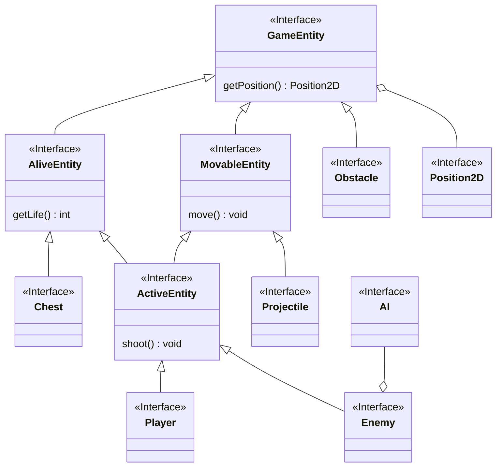
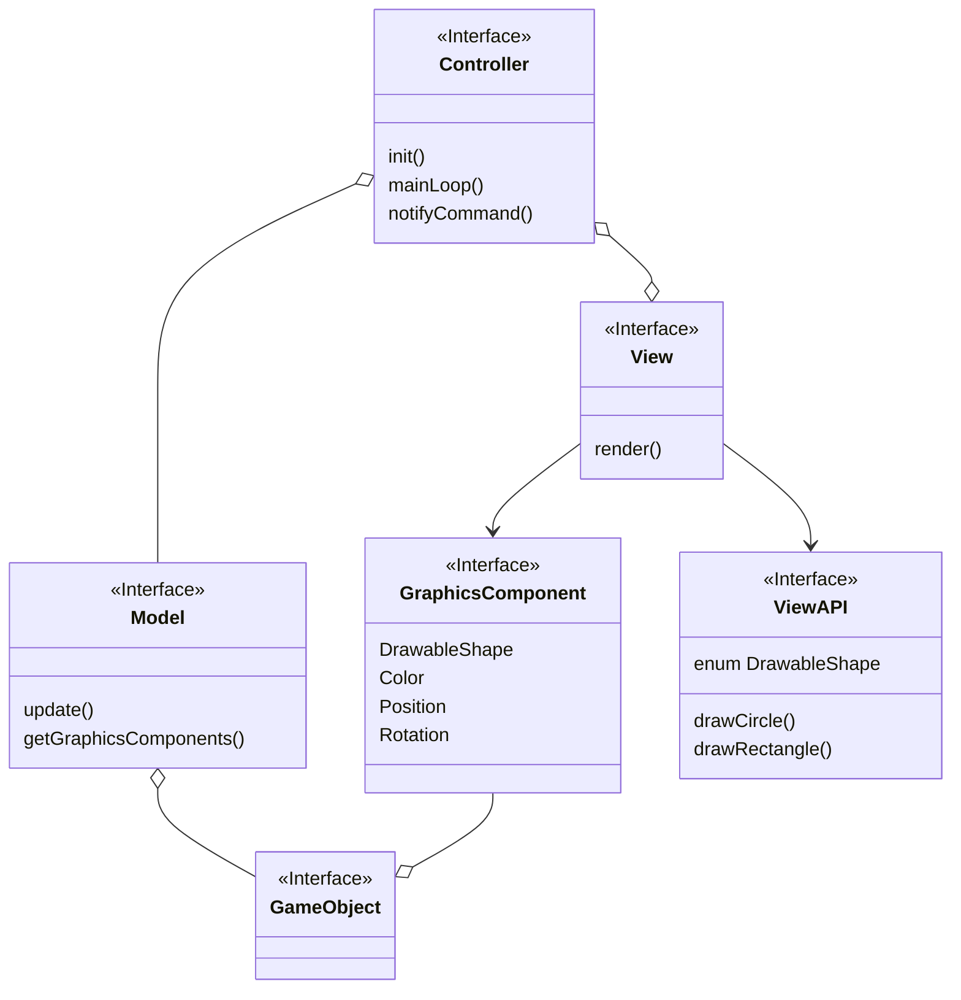

# Capitolo 1 - Analisi
## 1.1 Requisiti
Il software, ispirato alla modalità Robo-Rumble di Brawl Stars della Supercell, è un gioco 2d top-down il cui obiettivo è quello di difendere per più tempo possibile il centro della mappa e sopravvivere agli attacchi continui di orde nemiche.
### Requisiti funzionali
- La partita termina in caso di esaurimento dei punti vita del giocatore o del centro della mappa.
- Il player:
  - deve essere controllabile tramite tastiera nelle quattro direzioni.
  - deve essere in grado di sparare proiettili ai nemici in una direzione scelta tramite il mouse.
- I nemici:
  - nascono ad ondate.
  - attaccano il centro della mappa o il giocatore.
- Il livello di difficoltà cresce man mano che il gioco avanza.
- Il gioco è top-down con visuale dall'alto.
- L'ambiente di gioco è delimitato e include ostacoli fisici che il giocatore può usare come copertura.
### Requisiti non funzionali
- Il gioco si presenta con una grafica minimale composta da figure geometriche.
- L'applicazione si presenta con un menu iniziale.
- Il software:
  - deve essere eseguibile in modo fluido.
  - deve essere compatibile con una varia gamma di hardware e sistemi operativi (Linux, Windows e MacOS). 
## 1.2 Analisi e modello del dominio
Il gioco ha luogo all'interno di una mappa, la quale contiene il giocatore, i nemici e gli oggetti permanenti (e.g. muri e cassa centrale). Il player e i nemici devono potersi muovere liberamente all'interno di essa, secondo la volontà del giocatore oppure in base ad un' AI stabilita e possono sparare proiettili per cercare di danneggiare il proprio obiettivo. Il player, i nemici e la cassa infatti hanno un quantitativo di punti vita e all'esaurimento di questi l'entità muore.

# Capitolo 2 - Design
## 2.1 Architettura
L'architettura del nostro programma è quella del tipico Model View Controller. L'applicazione si compone di un controller composto da una singola view che svolge il ruolo di visualizzare gli elementi passati dal controller e di ricevere input dalle periferiche e passarle al controller. Il controller gestisce il main loop del gioco e il passaggio degli input dalla view al model, e dei dati da stampare (sotto forma di GraphicsComponent) dal Model alla View.
Per questo motivo View e Model sono indipendenti tra di loro e si affidano unicamente al controller. Facendo riferimento alle interfacce richieste è possibile cambiare tecnologia della View facilmente in quanto è necessario solo definire la finestra, i metodi per stampare le forme richieste dal gioco (in ViewAPI) e notificare il controller degli input.
Il controller richiama l'update del model, gli passa gli input, prende da lui i componenti grafici che devono essere stampati e ne legge lo stato del gioco. 
Per questo motivo è anche facile cambiare il model dell'applicazione e riusare il resto dell'applicazione per altri giochi.

```
Nel rendering la View chiede al controller i componenti grafici da stampare (di tutti gli elementi del gioco) e ciclandoli li stampa seguendo le loro indicazioni

Controller (ENGINE):
- init:
  - crea finestra
  - crea model
- mainLoop:
  - come da gameAsALab
- l'input lo prende la view, la passa al controller (pattern Observer step 4 gameAsALab), il controller lo passa al model.
```
## 2.2 Design dettagliato
# Capitolo 3 - Sviluppo
## 3.1 Testing automatizzato
## 3.2 Note di sviluppo
### Baldazzi Andrea
### Bittasi Francesco
### Marchi Luca
### Monaco Andrea
# Capitolo 4 - Commenti finali
## 4.1 Autovalutazione e lavori futuri
## 4.2 Difficoltà incontrate e commenti per i docenti
