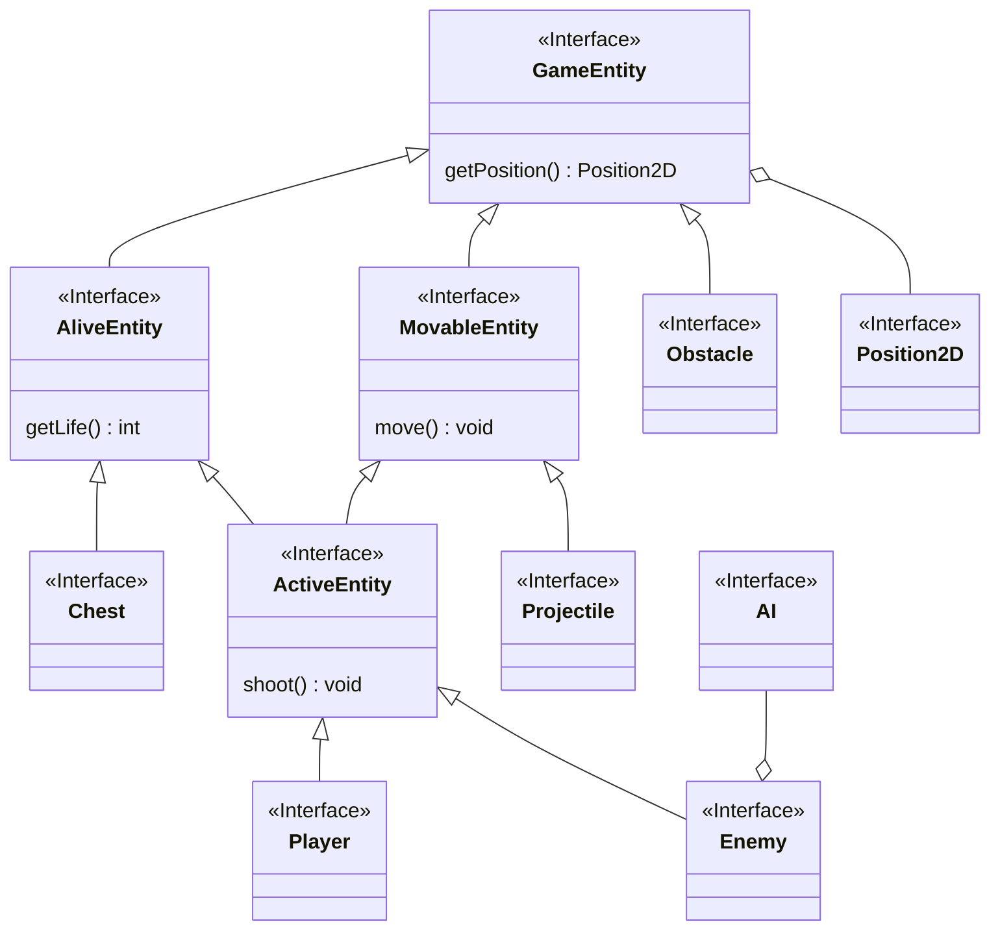
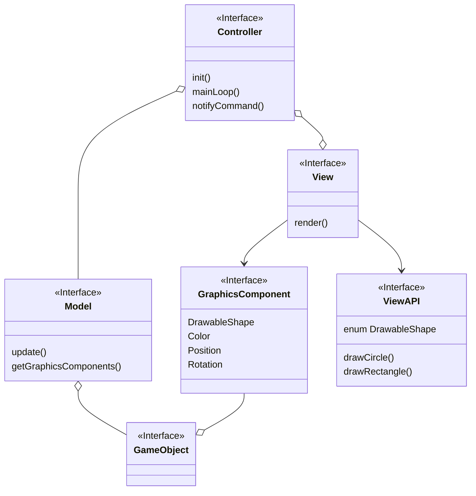
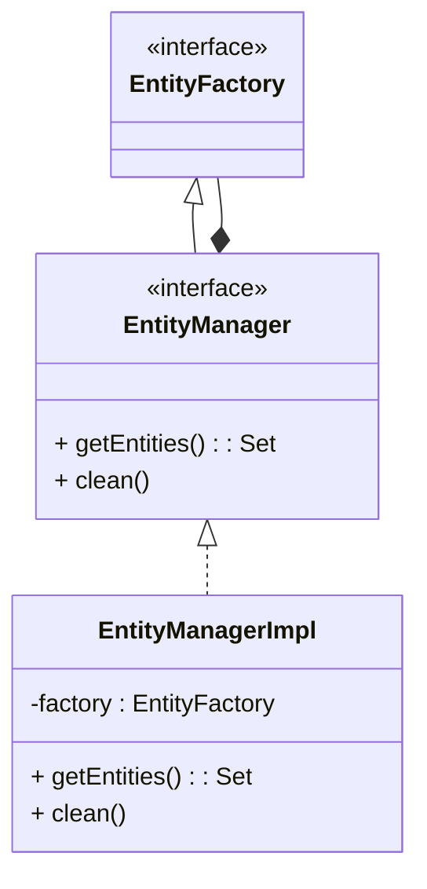
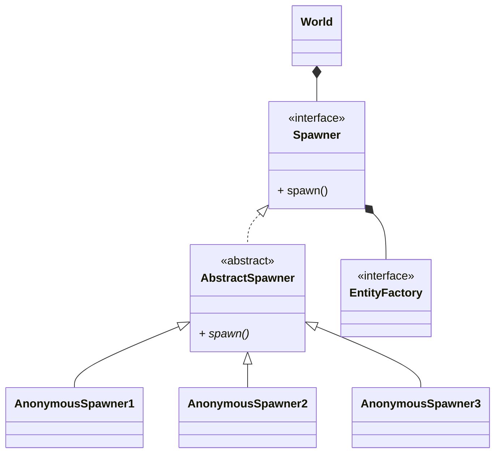
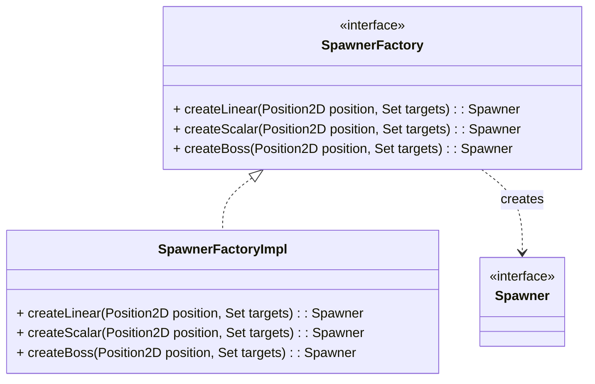
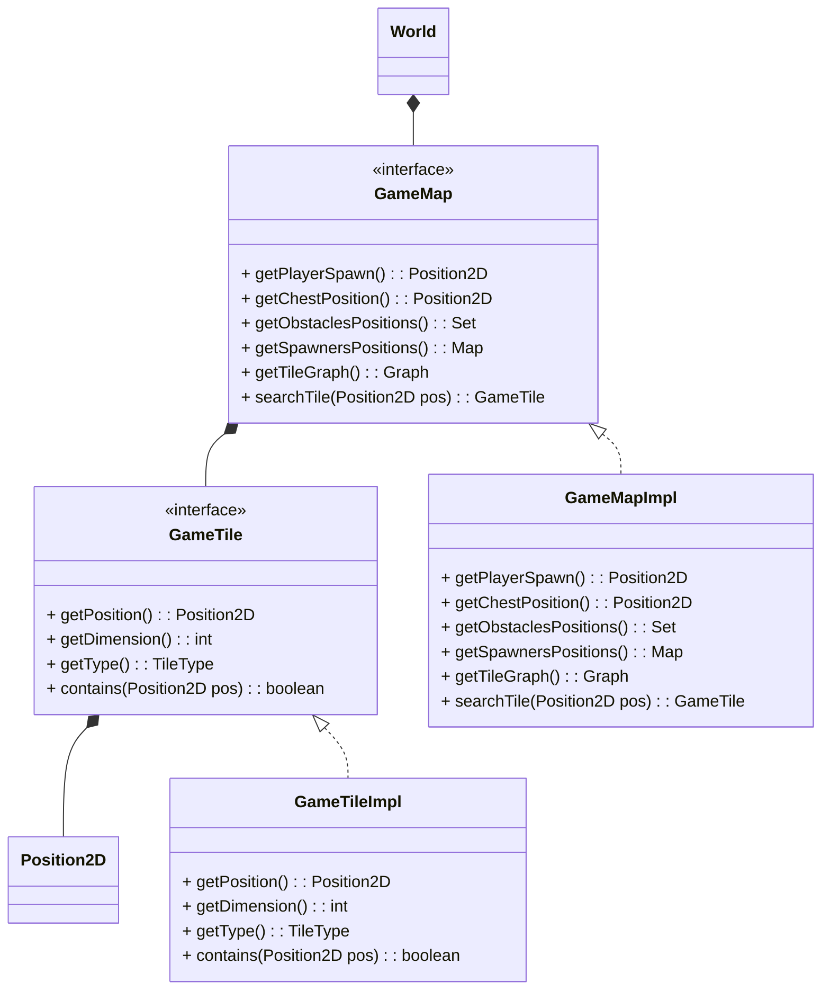

# Capitolo 1 - Analisi
## 1.1 Requisiti
Il software, ispirato alla modalità Robo-Rumble di Brawl Stars della Supercell, è un gioco 2d top-down il cui obiettivo è quello di difendere per più tempo possibile il centro della mappa e sopravvivere agli attacchi continui di orde nemiche.
### Requisiti funzionali
- La partita termina in caso di esaurimento dei punti vita del giocatore o del centro della mappa.
- Il player:
  - deve essere controllabile tramite tastiera nelle quattro direzioni.
  - deve essere in grado di sparare proiettili ai nemici in una direzione scelta tramite il mouse.
- I nemici:
  - nascono ad ondate.
  - attaccano il centro della mappa o il giocatore.
- Il livello di difficoltà cresce man mano che il gioco avanza.
- Il gioco è top-down con visuale dall'alto.
- L'ambiente di gioco è delimitato e include ostacoli fisici che il giocatore può usare come copertura.
### Requisiti non funzionali
- Il gioco si presenta con una grafica minimale composta da figure geometriche.
- L'applicazione si presenta con un menu iniziale.
- Il software:
  - deve essere eseguibile in modo fluido.
  - deve essere compatibile con una varia gamma di hardware e sistemi operativi (Linux, Windows e MacOS). 
## 1.2 Analisi e modello del dominio
Il gioco ha luogo all'interno di una mappa, la quale contiene il giocatore, i nemici e gli oggetti permanenti (e.g. muri e cassa centrale). Il player e i nemici devono potersi muovere liberamente all'interno di essa, secondo la volontà del giocatore oppure in base ad un' AI stabilita e possono sparare proiettili per cercare di danneggiare il proprio obiettivo. Il player, i nemici e la cassa infatti hanno un quantitativo di punti vita e all'esaurimento di questi l'entità muore.

# Capitolo 2 - Design
## 2.1 Architettura
L'architettura del nostro programma è quella del tipico Model View Controller. L'applicazione si compone di un controller composto da una singola view che svolge il ruolo di visualizzare gli elementi passati dal controller e di ricevere input dalle periferiche e passarle al controller. Il controller gestisce il main loop del gioco e il passaggio degli input dalla view al model, e dei dati da stampare (sotto forma di GraphicsComponent) dal Model alla View.
Per questo motivo View e Model sono indipendenti tra di loro e si affidano unicamente al controller. Facendo riferimento alle interfacce richieste è possibile cambiare tecnologia della View facilmente in quanto è necessario solo definire la finestra, i metodi per stampare le forme richieste dal gioco (in ViewAPI) e notificare il controller degli input.
Il controller richiama l'update del model, gli passa gli input, prende da lui i componenti grafici che devono essere stampati e ne legge lo stato del gioco. 
Per questo motivo è anche facile cambiare il model dell'applicazione e riusare il resto dell'applicazione per altri giochi.

## 2.2 Design dettagliato
### Baldazzi Andrea
#### Creazione e salvataggio di entità di gioco

**Problema:** creare facilmente entità senza fare troppe ripetizioni di codice.
In particolare bisogna fare in modo che chiunque voglia creare un'entità di gioco non deve occuparsi di 
aggiungerla da qualche parte. 

**Soluzione:** dato che era già stata predisposta la creazione di una factory di entità (realizzata da Luca Marchi) si è ritenuto
opportuno creare una struttura che tenesse in memoria le entità generate e si occupasse di distruggerle qual'ora ce ne 
fosse stato il bisogno, ovvero l'EntityManager. Allo scopo è stato utile ricorrere al pattern Decorator, che permette 
al manager di essere riconosciuto come una factory di entità, ma con funzioni aggiuntive per ottenere tutte le entità in gioco
e per fare "pulizia" di quelle che vanno eliminate. 

---
#### Gestione efficiente dello spawning

**Problema:** creare un meccanismo di spawning efficiente e modulare, di modo che sia facile far cominciare un nuovo livello.

**Soluzione:** al fine di risolvere il problema, si è ritenuto utile creare un oggetto apposito che si occupasse
solamente di generare nuovi nemici. Lo Spawner, infatti, al richiamo di `spawn()` genera un nuovo nemico secondo dei criteri stabiliti
a priori. Di fatto, dunque, quando comincia un nuovo livello il resposabile della gestione di gioco attiva l'azione su tutti gli spawner.
Questo comportamento si avvicina molto al pattern Command, in cui l'azione `execute()` viene rinominata `spawn()` per chiarezza d'uso.
Allo stesso tempo, si differenzia dal pattern per la presenza di funzionalità aggiuntive per la gestione della difficoltà e del tipo dello spawner.

Oltretutto c'è anche la necessità di avere spawner che generano entità con proprietà diverse, come statistiche che incrementano col tempo oppure boss. A tal proposito si è utilizzato il pattern Factory methods, in cui 
un oggetto si occupa della creazione di Spawner definendo i criteri per l'azione `spawn()`

---
#### Organizzazione della mappa

**Problema:** suddividere la mappa per poter permettere ai nemici di seguire un percorso verso il loro obbiettivo.

**Soluzione:** l'idea è stata quella di suddividere la mappa di gioco in delle celle chiamate GameTile, di cui ne è composta. Ogni cella ha delle proprietà, come una posizione, una dimensione e un tipo e riesce a determinare se una
data entità di gioco è contenuta al suo interno. La mappa invece è passiva, cioè contiene i criteri per il posizionamento degli oggetti nel gioco, ad esempio la posizione della cassa, dei muri o degli spawner.
Inoltre, alla sua creazione si occupa di creare un grafo delle GameTile libere, che verrà sfruttato dalla AI dei nemici
per permettere loro di inseguire un certo target.

### Bittasi Francesco
### Marchi Luca
### Monaco Andrea
# Capitolo 3 - Sviluppo
## 3.1 Testing automatizzato
## 3.2 Note di sviluppo
### Baldazzi Andrea
#### Utilizzo della libreria JGraphT
Utilizzata per costruire il grafo di GameTile: https://github.com/frabitta/OOP23-gfight/blob/1f46024e7a794b0b54e1317836fbd691eb322ea7/src/main/java/gfight/world/map/impl/GameMapImpl.java#L138

#### Utilizzo di Optional
Per costruire il grafo solo quando necessario e velocizzare la creazione della mappa: https://github.com/frabitta/OOP23-gfight/blob/1f46024e7a794b0b54e1317836fbd691eb322ea7/src/main/java/gfight/world/map/impl/GameMapImpl.java#L109

#### Utilizzo di Stream
Usati molto frequentemente, due esempi:
- https://github.com/frabitta/OOP23-gfight/blob/1f46024e7a794b0b54e1317836fbd691eb322ea7/src/main/java/gfight/world/map/impl/GameMapImpl.java#L83
- https://github.com/frabitta/OOP23-gfight/blob/1f46024e7a794b0b54e1317836fbd691eb322ea7/src/main/java/gfight/world/impl/EntityManagerImpl.java#L114

#### Utilizzo di Lambda
Un esempio: https://github.com/frabitta/OOP23-gfight/blob/1f46024e7a794b0b54e1317836fbd691eb322ea7/src/main/java/gfight/view/impl/MenuPanel.java#L95

### Bittasi Francesco
### Marchi Luca
### Monaco Andrea
# Capitolo 4 - Commenti finali
## 4.1 Autovalutazione e lavori futuri
### Baldazzi Andrea
Questo progetto è nato dall'idea di realizzare un gioco graficamente semplice, ma ben modellato e credo che 
il nostro lavoro sia riuscito a soddisfare questo obbiettivo. In particolare siamo riusciti molto bene a collaborare
tra di noi e ad affrontare i problemi insieme per trovare le migliori soluzioni. Per quanto riguarda
la sfera personale, penso di aver fatto il mio meglio ed essermi impegnato per quanto riuscissi e sono soddisfatto di
ciò che ho realizzato. Per quanto ci siano delle parti di codice un po' macchinose, come la lettura della mappa da file, o il salvataggio delle statistiche, credo di essere riuscito a sviluppare codice riutilizzabile e facilmente
manutenibile.
## 4.2 Difficoltà incontrate e commenti per i docenti
