# Capitolo 1 - Analisi
## 1.1 Requisiti
Il software, ispirato alla modalità Robo-Rumble di Brawl Stars della Supercell, è un gioco 2d top-down il cui obiettivo è quello di difendere per più tempo possibile il centro della mappa e sopravvivere agli attacchi continui di orde nemiche.
### Requisiti funzionali
- La partita termina in caso di esaurimento dei punti vita del giocatore o del centro della mappa.
- Il player:
  - deve essere controllabile tramite tastiera nelle quattro direzioni.
  - deve essere in grado di sparare proiettili ai nemici in una direzione scelta tramite il mouse.
- I nemici:
  - nascono ad ondate.
  - attaccano il centro della mappa o il giocatore.
- Il livello di difficoltà cresce man mano che il gioco avanza.
- Il gioco è top-down con visuale dall'alto.
- L'ambiente di gioco è delimitato e include ostacoli fisici che il giocatore può usare come copertura.
### Requisiti non funzionali
- Il gioco si presenta con una grafica minimale composta da figure geometriche.
- L'applicazione si presenta con un menu iniziale.
- Il software:
  - deve essere eseguibile in modo fluido.
  - deve essere compatibile con una varia gamma di hardware e sistemi operativi (Linux, Windows e MacOS). 
## 1.2 Analisi e modello del dominio
Il gioco ha luogo all'interno di una mappa, la quale contiene il giocatore, i nemici e gli oggetti permanenti (e.g. muri e cassa centrale). Il player e i nemici devono potersi muovere liberamente all'interno di essa, secondo la volontà del giocatore oppure in base ad un' AI stabilita e possono sparare proiettili per cercare di danneggiare il proprio obiettivo. Il player, i nemici e la cassa infatti hanno un quantitativo di punti vita e all'esaurimento di questi l'entità muore.
```mermaid
classDiagram 
    GameEntity <|-- AliveEntity
    GameEntity <|-- MovableEntity
    GameEntity <|-- Obstacle

    AliveEntity <|-- Chest
    AliveEntity<|--ActiveEntity
    MovableEntity<|--Projectile
    MovableEntity<|--ActiveEntity

    ActiveEntity<|--Player
    ActiveEntity<|--Enemy

    AI --o Enemy
    GameEntity o-- Position2D

    <<Interface>> AI
    <<Interface>> Position2D
    <<Interface>> ActiveEntity
    <<Interface>> Obstacle
    <<Interface>> MovableEntity
    <<Interface>> Projectile
    <<Interface>> Chest
    <<Interface>> Player
    <<Interface>> Enemy
    <<Interface>> AliveEntity
    <<Interface>> GameEntity

    class GameEntity{
        getPosition() Position2D
    }

    class AliveEntity{
        getLife() int
    }

    class MovableEntity{
        move()  void
    }

    class Position2D {
    }

    class ActiveEntity{
        shoot() void
    }
```
# Capitolo 2 - Design
## 2.1 Architettura
L'architettura del nostro programma è quella del tipico Model View Controller. L'applicazione si compone di un controller composto da una singola view che svolge il ruolo di visualizzare gli elementi passati dal controller e di ricevere input dalle periferiche e passarle al controller. Il controller gestisce il main loop del gioco e il passaggio degli input dalla view al model, e dei dati da stampare (sotto forma di GraphicsComponent) dal Model alla View.
Per questo motivo View e Model sono indipendenti tra di loro e si affidano unicamente al controller. Facendo riferimento alle interfacce richieste è possibile cambiare tecnologia della View facilmente in quanto è necessario solo definire la finestra, i metodi per stampare le forme richieste dal gioco (in ViewAPI) e notificare il controller degli input.
Il controller richiama l'update del model, gli passa gli input, prende da lui i componenti grafici che devono essere stampati e ne legge lo stato del gioco. 
Per questo motivo è anche facile cambiare il model dell'applicazione e riusare il resto dell'applicazione per altri giochi.
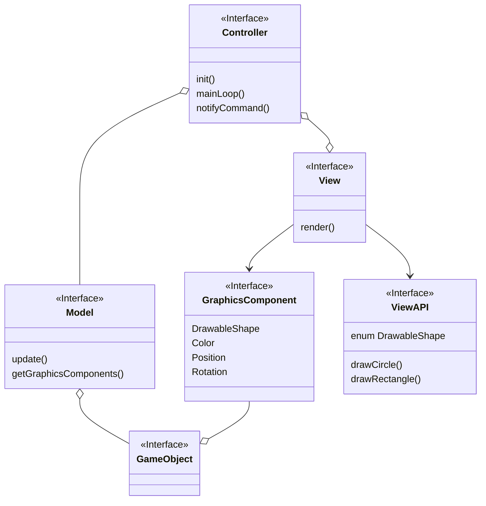
## 2.2 Design dettagliato
### Baldazzi Andrea
#### Creazione e salvataggio di entità di gioco

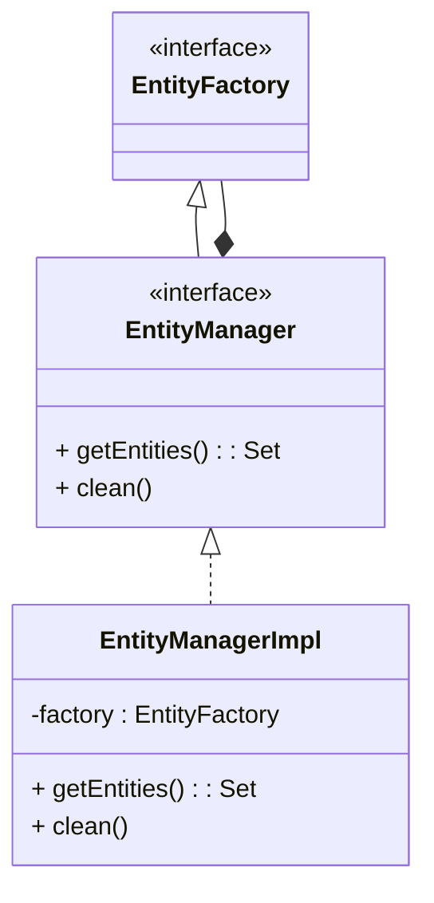

**Problema:** creare facilmente entità senza fare troppe ripetizioni di codice.
In particolare bisogna fare in modo che chiunque voglia creare un'entità di gioco non deve occuparsi di 
aggiungerla da qualche parte. 

**Soluzione:** dato che era già stata predisposta la creazione di una factory di entità (realizzata da Luca Marchi) si è ritenuto
opportuno creare una struttura che tenesse in memoria le entità generate e si occupasse di distruggerle qual'ora ce ne 
fosse stato il bisogno, ovvero l'EntityManager. Allo scopo è stato utile ricorrere al pattern Decorator, che permette 
al manager di essere riconosciuto come una factory di entità, ma con funzioni aggiuntive per ottenere tutte le entità in gioco
e per fare "pulizia" di quelle che vanno eliminate. 

---
#### Gestione efficiente dello spawning

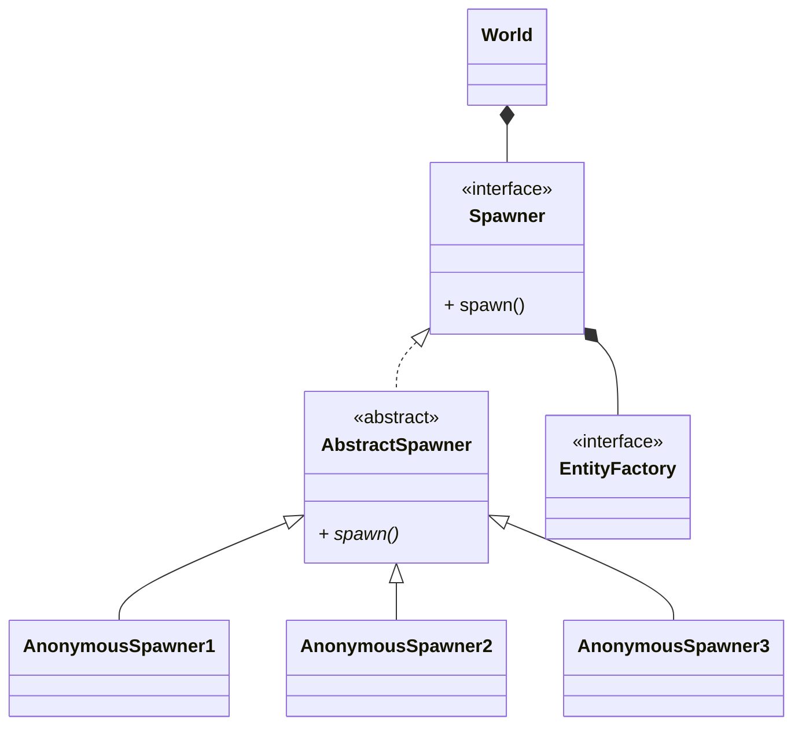

**Problema:** creare un meccanismo di spawning efficiente e modulare, di modo che sia facile far cominciare un nuovo livello.

**Soluzione:** al fine di risolvere il problema, si è ritenuto utile creare un oggetto apposito che si occupasse
solamente di generare nuovi nemici. Lo Spawner, infatti, al richiamo di `spawn()` genera un nuovo nemico secondo dei criteri stabiliti
a priori. Di fatto, dunque, quando comincia un nuovo livello il resposabile della gestione di gioco attiva l'azione su tutti gli spawner.
Questo comportamento si avvicina molto al pattern Command, in cui l'azione `execute()` viene rinominata `spawn()` per chiarezza d'uso.
Allo stesso tempo, si differenzia dal pattern per la presenza di funzionalità aggiuntive per la gestione della difficoltà e del tipo dello spawner.

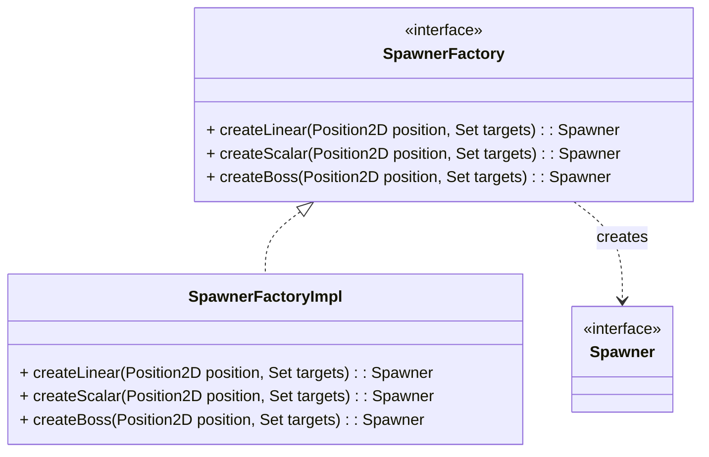

Oltretutto c'è anche la necessità di avere spawner che generano entità con proprietà diverse, come statistiche che incrementano col tempo oppure boss. A tal proposito si è utilizzato il pattern Factory methods, in cui 
un oggetto si occupa della creazione di Spawner definendo i criteri per l'azione `spawn()`

---
#### Organizzazione della mappa

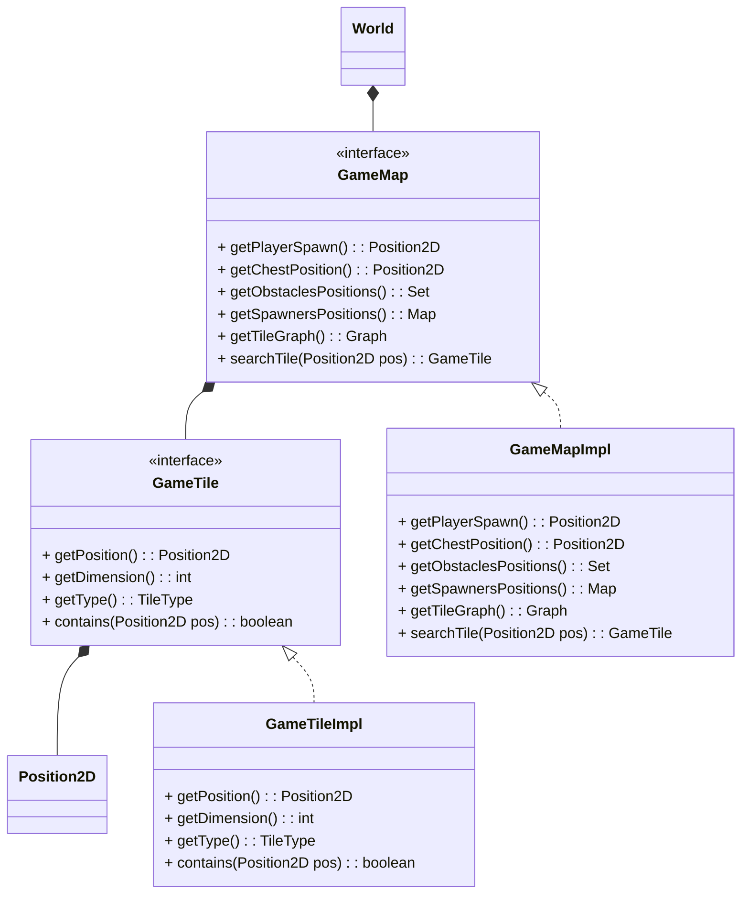

**Problema:** suddividere la mappa per poter permettere ai nemici di seguire un percorso verso il loro obbiettivo.

**Soluzione:** l'idea è stata quella di suddividere la mappa di gioco in delle celle chiamate GameTile, di cui ne è composta. Ogni cella ha delle proprietà, come una posizione, una dimensione e un tipo e riesce a determinare se una
data entità di gioco è contenuta al suo interno. La mappa invece è passiva, cioè contiene i criteri per il posizionamento degli oggetti nel gioco, ad esempio la posizione della cassa, dei muri o degli spawner.
Inoltre, alla sua creazione si occupa di creare un grafo delle GameTile libere, che verrà sfruttato dalla AI dei nemici
per permettere loro di inseguire un certo target.

### Bittasi Francesco
#### GraphicsComponent
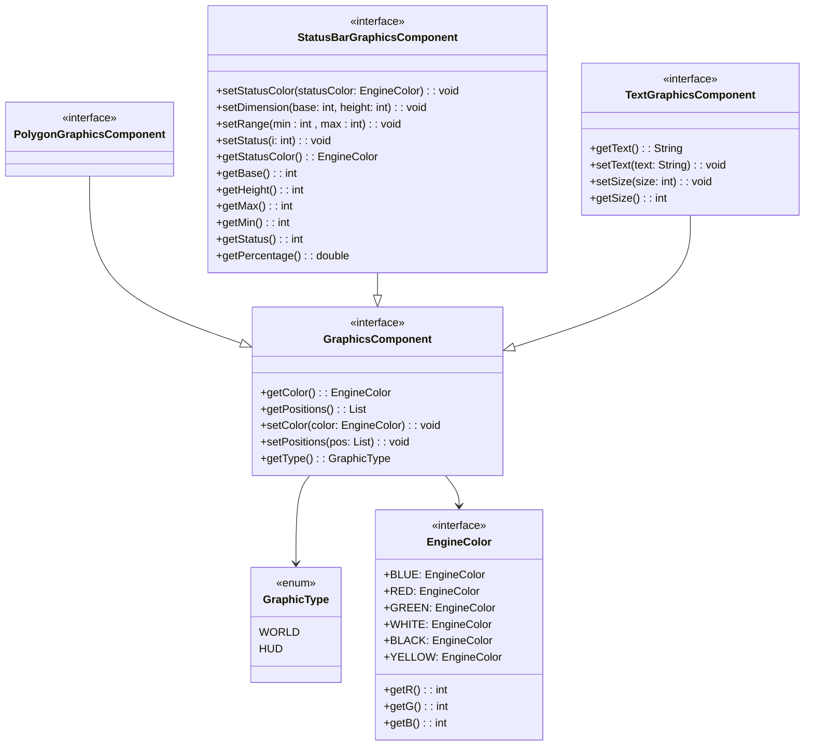
**Problema:** Creare oggetti che rappresentino l'aspetto grafico di elementi del modello del gioco, in maniera indipendente dalla tecnologia della View.

**Soluzione:** L'interfaccia GraphicsComponent rappresenta un componente grafico generico, questa può essere specializzao in più tipi: Testo, Poligono, Barra di stato, etc.
- Il model dell'applicazione si occupa di creare e aggiornare questi oggetti per dire che aspetto devono assumere gli elementi del gioco.
- Avendo definito tutte queste proprietà, tra cui i colori e che tipo di elemento grafico sono (se parte del mondo di gioco o della HUD), questi componenti grafici sono totalmente indipendenti dalla tecnologia di View adottata.

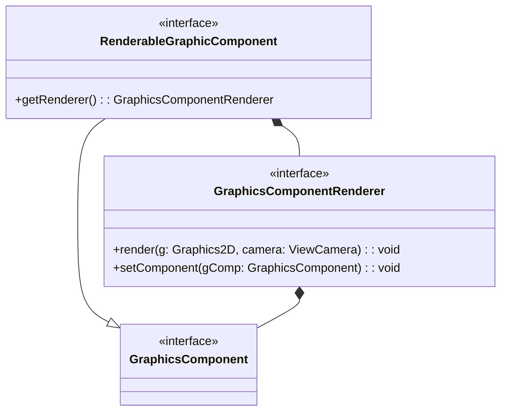
**Problema:** Permettere alla view di leggere questi componenti grafici e rappresentarli a schermo.

**Soluzione:** Per facilitare la view nell'interpretare questi oggetti è stata definita un'interfaccia che estende GraphicsComponent e che permette di contenere un oggetto che si occupa di renderizzare questi componenti grafici, specifico per la tecnologia usata.
- Il GraphicsComponentRenderer è dunque unico per Swing: è legato ad un solo componente grafico e alla chiamata del metodo `render` lo stampa a schermo avendo il riferimento alla Camera e all'oggetto Graphics2D.
- Per l'implementazione della view alla fine i componenti grafici che le vengono passati si comportano similmente al pattern Command: ottenuto il set di Componenti grafici filtra quelli che è capace di interpretare (chi implementa RenderableGraphicComponent) e li stampa a schermo chiamando il metodo `render`.

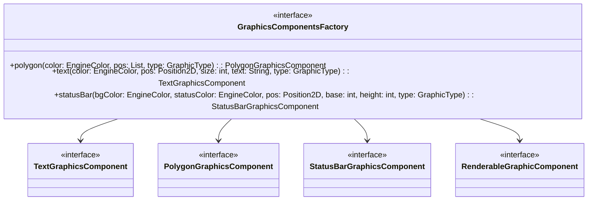

**Problema:** creare facilmente i componenti grafici.

**Soluzione:** Per permettere al Model dell'applicazione di creare i componenti grafici senza dover sapere dell'associazione di questi coi GraphicsComponentRenderer è stata creata una factory che restituisse il tipo di componente grafico richiesto con già incorporato il renderer della view necessario per permetterne la stampa.

#### Camera
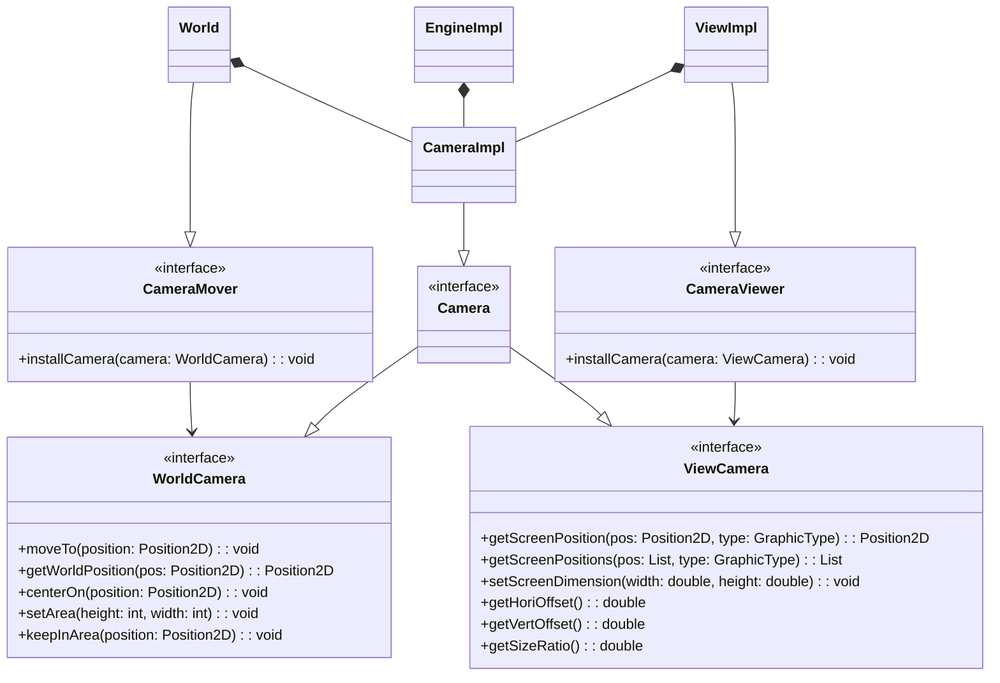
**Problema:** Sullo schermo va visualizzata solo una parte del mondo di gioco, deve mantere le proporzioni corrette per qualunque formato di schermo e la porzione visibile deve essere scelta dal Model dell'applicazione.

**Soluzione:** L'engine si occupa di creare un oggetto (nel progetto la classe "CameraImpl") che si occupa di effettuare i calcoli di conversione da coordinate del mondo a coordinate sullo schermo e viceversa. L'engine darà il riferimento a questo oggetto al World e all'EngineView che lo interfacceranno tramite delle interfacce specifiche per quello che ci possono fare:
- Il world ha accesso ai metodi che gli permettono di spostare la telecamera e di ottenere le coordinate del mondo a partire da quelle sullo schermo (nel caso di quando si riceve input dal puntatore).
- L'EngineView ha accesso ai metodi di conversione delle coordinate da world a schermo, metodi per informare la telecamera delle dimensioni della finestra e per ottenere informazioni sulle proporzioni della schermata di gioco (per poter generare bande nere a bordo schermo se necessario).
    - al momento della stampa l'EngineView passa il riferimento della ViewCamera ai GraphicsComponentRenderer che si occupano della effettiva stampa a schermo.

Non è stato adottato alcun design pattern particolare se non lo Strategy: le diverse interfacce definiscono infatti una classe Camera generica che può avere l'implementazione che vogliamo, quella adottata nel nostro gioco è una implementazione standard, ma potremmo adottarne una che segue una logica diversa andando a distorcere le cose visualizzate a schermo senza dover modificare in alcun modo le classi che usano la telecamera.

A differenza della view, potrebbero esserci più oggetti che si occupano di muovere la telecamera, per questo motivo è stato definita anche l'interfaccia di chi può farlo (CameraMover) per poter ricevere il riferimento alla telecamera.

#### Input
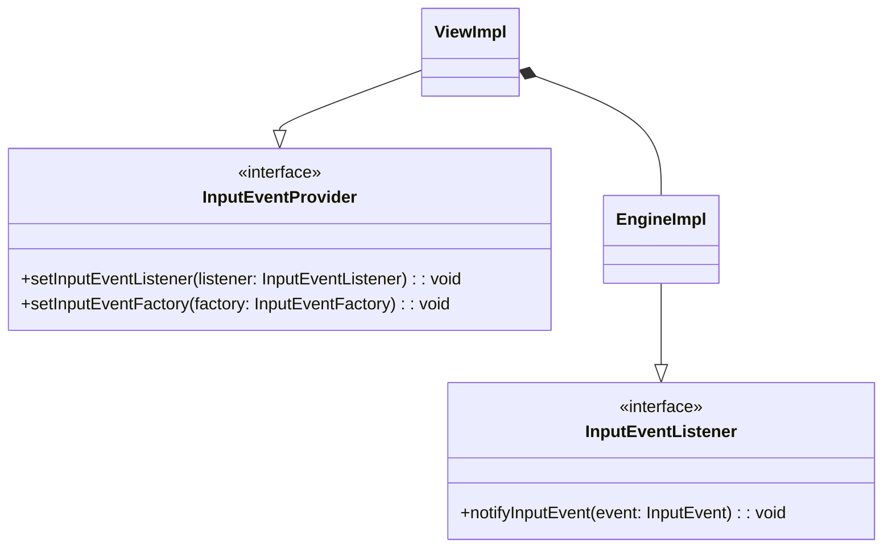
**Problema:** Notificare il controller delle azioni dell'utente sulle periferiche.

**Soluzione:** Usando il pattern Observer abbiamo reso l'implementazione del controller un osservatore di "InputEvent". La view è il provider, il creatore di questi InputEvent e si occupa di notificare il controller quando uno di questi avviene.

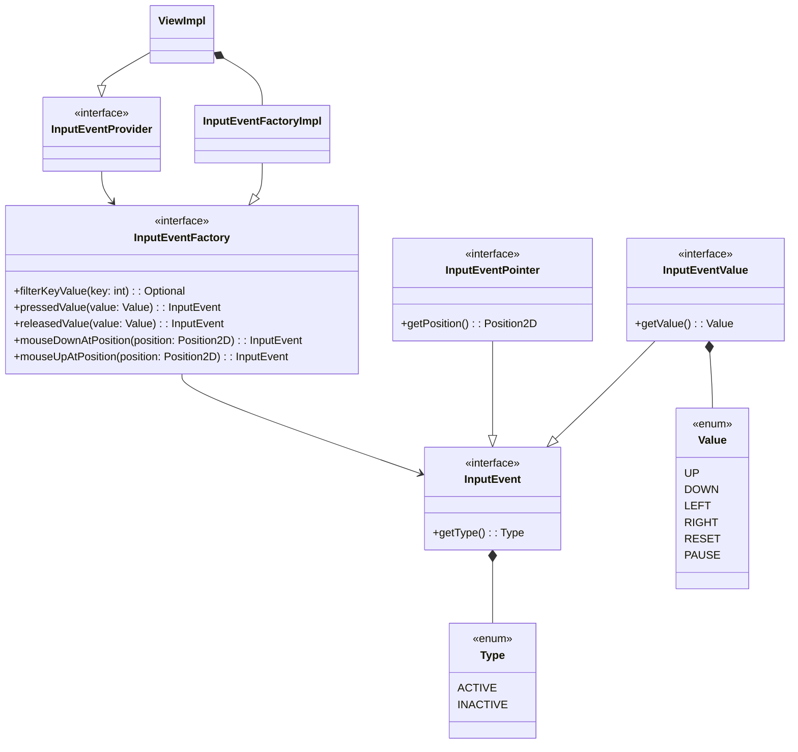
**Problema:** Creare una classe di oggetti che rappresenti gli eventi di input indipendentemente dalla tecnologia di View adottata.

**Soluzione:** L'interfaccia InputEvent rappresenta un evento di Input che può essere ricevuto da un InputEventListener. Questa interfaccia viene poi estesa in tipologie secondarie che vanno a specificare un tipo particolare di input come quelle di un puntatore o di un determinato valore.
- Per permettere al provider di generare questi oggetti facilmente abbiamo creato una Factory di eventi che gli viene fornita.
- E' grazie al metodo `filterKeyValue` della factory che i tasti della tastiera vengono convertiti in valori che rappresentano un'azione di gioco.
- Sarà compito del listener filtrare i vari input che riceve per vedere cosa gli interessa e agire di conseguenza.

#### Weapon
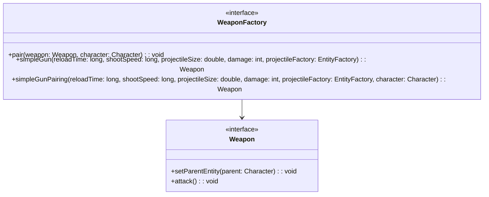

**Problema:** Creare un'arma che possa essere facilmente associata ad un unico personaggio.

**Soluzione:** Una Factory di Weapon fornisce metodi per creare facilmente il tipo di arma desiderato e per associarla ad un personaggio. La armi implementano l'interfaccia Weapon che identifica un tipo di arma generico (pattern Strategy), questo permette di creare armi con comportamenti diversi senza dover modificare il codice che le utilizza (questo non è stato fatto nel progetto solo per questione di tempo): basta creare nuove implementazioni di Weapon e aggiungere i metodi nella factory.

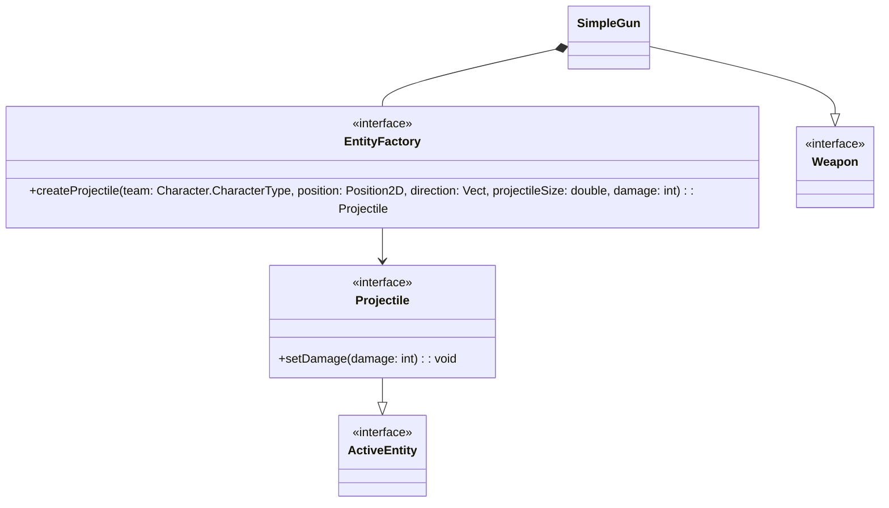

**Problema:** Creare un'arma che possa sparare dei proiettili.

**Soluzione:** SimpleGun implementa l'interfaccia Weapon e fa riferimento ad una EntityFactory per generare nuovi proiettili; questi infatti sono delle ActiveEntiy, entità che si possono muovere e collidere con altre. SimpleGun alla creazione accetta parametri per impostare la velocità di sparo, la dimensione dei proiettili, la loro velocità e danno. Dunque solo da SimpleGun si potrebbero creare diversi tipi di armi.

### Marchi Luca
### Monaco Andrea
# Capitolo 3 - Sviluppo
## 3.1 Testing automatizzato
## 3.2 Note di sviluppo
### Baldazzi Andrea
#### Utilizzo della libreria JGraphT
Utilizzata per costruire il grafo di GameTile: https://github.com/frabitta/OOP23-gfight/blob/1f46024e7a794b0b54e1317836fbd691eb322ea7/src/main/java/gfight/world/map/impl/GameMapImpl.java#L138

#### Utilizzo di Optional
Per costruire il grafo solo quando necessario e velocizzare la creazione della mappa: https://github.com/frabitta/OOP23-gfight/blob/1f46024e7a794b0b54e1317836fbd691eb322ea7/src/main/java/gfight/world/map/impl/GameMapImpl.java#L109

#### Utilizzo di Stream
Usati molto frequentemente, due esempi:
- https://github.com/frabitta/OOP23-gfight/blob/1f46024e7a794b0b54e1317836fbd691eb322ea7/src/main/java/gfight/world/map/impl/GameMapImpl.java#L83
- https://github.com/frabitta/OOP23-gfight/blob/1f46024e7a794b0b54e1317836fbd691eb322ea7/src/main/java/gfight/world/impl/EntityManagerImpl.java#L114

#### Utilizzo di Lambda
Un esempio: https://github.com/frabitta/OOP23-gfight/blob/1f46024e7a794b0b54e1317836fbd691eb322ea7/src/main/java/gfight/view/impl/MenuPanel.java#L95

### Bittasi Francesco
#### Utilizzo di Stream
Adottate frequentemente per la gestione di elenchi di dati:
- https://github.com/frabitta/OOP23-gfight/blob/fb4012549a225ac1774cfe5618e629f0fbe8a238/src/main/java/gfight/engine/input/impl/InputEventFactoryImpl.java#L18
- paint in canvas
- PolygonGraphicsRenderer

#### Utilizzo di Optional
Usati per convertire i tasti premuti in possibili Value:
- https://github.com/frabitta/OOP23-gfight/blob/fb4012549a225ac1774cfe5618e629f0fbe8a238/src/main/java/gfight/engine/input/impl/InputEventFactoryImpl.java#L18

#### Sincronizzazioni dei thread
nella classe EngineImpl
- Semaphore per input: processInput, notifyInputEvent
- sincronizzazione tramite wait e notify per gli stati dell'engine: holdPageUntilNotified, changeStatus

#### Game as a lab
Ho preso ispirazione dal codice di Game as a lab per la base dell'engine e della view, in particolare per la scrittura della classe `Canvas`.

### Marchi Luca
### Monaco Andrea
# Capitolo 4 - Commenti finali
## 4.1 Autovalutazione e lavori futuri
### Baldazzi Andrea
Questo progetto è nato dall'idea di realizzare un gioco graficamente semplice, ma ben modellato e credo che 
il nostro lavoro sia riuscito a soddisfare questo obbiettivo. In particolare siamo riusciti molto bene a collaborare
tra di noi e ad affrontare i problemi insieme per trovare le migliori soluzioni. Per quanto riguarda
la sfera personale, penso di aver fatto il mio meglio ed essermi impegnato per quanto riuscissi e sono soddisfatto di
ciò che ho realizzato. Per quanto ci siano delle parti di codice un po' macchinose, come la lettura della mappa da file, o il salvataggio delle statistiche, credo di essere riuscito a sviluppare codice riutilizzabile e facilmente
manutenibile.
### Bittasi Francesco
Sono abbastanza soddisfatto di quanto abbiamo prodotto: le scelte di design che abbiamo fatto ci hanno permesso di apportare numerose modifiche in corso d'opera, ma queste aggiunte/cambiamenti sono stati facili da implementare e non hanno mai rotto il resto del codice: segno che il design fatto a priori era efficace per i nostri obiettivi.
L'unione delle diverse parti di progetto svolte individualmente è stata immediata e senza problemi, potremmo anche implementare nuove feature nel gioco senza modificare il resto del codice: armi, tipi di giocatori e nemici diversi, grafica, etc.
Ci sono diversi casi in cui avrei potuto applicare design Pattern che non ho applicato o seguire tecniche di programmazione java più avanzate, ad esempio avrei potuto pensare di seguire il Decorator per creare le sottocategorie di input ed elementi grafici.
Avevo come parte del progetto una componente fondamentale per permetterne un funzionamento basilare: la gestione della grafica e degli input. Sono due elementi che portano molta soddisfazione da ragionare e implementare in quanto danno un immediato riscontro visivo; guardando indietro avrei potuto cedere l'implementazione delle armi ad un altro membro del gruppo per bilanciare meglio il carico di lavoro visto che anche solo quelle due hanno impiegato gran parte del tempo che ho dedicato al progetto.
Non credo svilupperemo ancora questo gioco, ma è possibile che nel tempo libero io prenda l'engine e la view di questo per sviluppare un gioco diverso.
## 4.2 Difficoltà incontrate e commenti per i docenti
